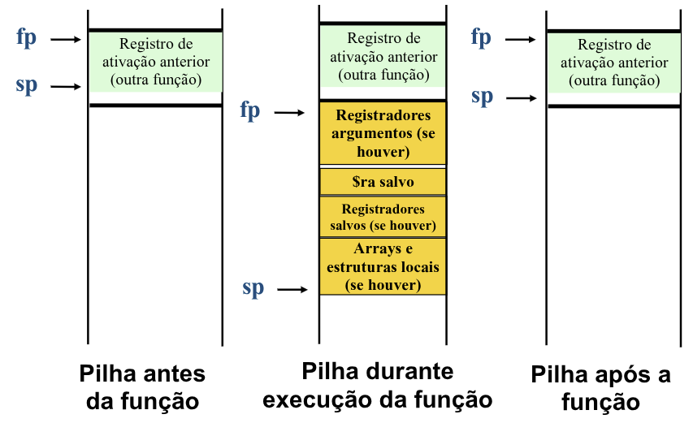
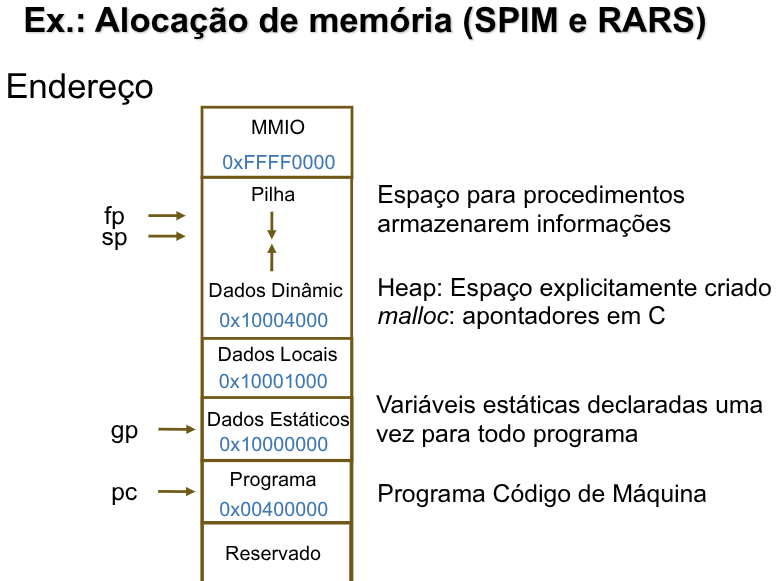

# Recursividade

Para explicar como o funcionamento de uma **função recursiva** no RISC-V vamos utilizar um exemplos de uma função que realiza a **soma** de n números.

## Exemplo: `soma_recursiva`

Suponha que tenhamos o seguinte código, que calcula a soma $n + (n - 1) + \ldots + 2 + 1$ de forma recursiva:

```c
int soma_rec(int n)
{
    return (n < 1) ? 0 : n + soma_rec(n - 1);
}
```

Vamos gerar o código correspondente em assembly RISC-V.
- O parâmetro **n** corresponde ao registrador **a0**. 
- Devemos  inicialmente  colocar um rótulo para a função, e salvar o endereço de retorno **ra** e o parâmetro **a0**: 

```asm
soma_rec:
    addi sp, sp, -8 # Prepara a pilha para recever 2 itens
    sw ra, 4(sp) # Empilha o ra - Endereço de Retorno
    sw a0, 0(sp) # Empilha a0 (n)
```

Na primeira vez que `soma_recursiva` é chamada, o valor de **ra** que é armazenado  corresponde ao **endereço** que está na **rotina chamadora**.

Vamos agora compilar o corpo da função. Inicialmente, testamos se `n < 1`:
```asm
slti t0, a0, 1 # Se a0 < 1, então t0 = 1, senão t0 = 0
beq t0, zero, L1 # Se n>= 1, vá para L1
```

Se `n < 1`, a função deve **retornar o valor 0**. Não podemos nos esquecer de **restaurar a pilha**.

```asm
add a0, zero, zero # Valor de Retorna
addi sp, sp, 8 
ret # Retorno
```

Se `n >= 1`, **decrementamos n** e **chamamos novamente a função soma_recursiva** com o novo valor de n.

```asm
L1:
    addi a0, a0, -1 # # argumento passa a ser (n-1)
    j soma_rec # calcula a soma para (n-1)
```

Quando a soma para (n-1) é calculada, o programa volta a executar na próxima  instrução. Restauramos o **endereço de retorno** e o argumento anteriores,  e incrementamos o apontador de **topo de pilha**:

```asm
lw t0, 0(sp)  # restaura o valor de n 
lw ra, 4(sp)  # restaura o endereço de retorno 
addi sp, sp, 8  # retira 2 itens da pilha.
```

Agora o registrador **a0** recebe a **soma do argumento antigo** `t0` com o **valor atual** em `a0` (soma_recursiva para n - 1):

```asm
add a0, a0, t0  # retorne n + soma_rec(n-1)
ret
```

### Resultado Final

```asm
Soma_rec: 
    addi sp, sp, -8 # prepara a pilha para receber 2 itens 
    sw ra, 4(sp)    # empilha $ra  (End. Retorno) 
    sw a0, 0(sp)    # empilha $a0 (n) 
    
    slti t0, a0, 1      # testa se n < 1 
    beq t0, zero, L1    # se n>=1, vá para L1 
    
    add a0, zero, zero  # valor de retorno é 0, Caso base
    addi sp, sp, 8      # remove 2 itens da pilha 
    
    ret # retorne para depois de jal 

L1: 
    addi  a0,  a0, -1   # argumento passa a ser (n-1) 
    j soma_rec  # calcula a soma para (n-1) 
    
    lw t0, 0(sp)    # restaura o valor de n 
    lw ra, 4(sp)    # restaura o endereço de retorno 
    addi sp, sp, 8  # retira 2 itens da pilha. 
    
    add a0, a0, t0  # retorne n + soma_recursiva(n-1) 
    
    ret # retorne para a chamadora
```

### O que "deve" ser preservado?

| Preservado                                              | Não Preservado      |
| ------------------------------------------------------- | ------------------- |
| Registradores s0-s11                                    | Registradores t0-t6 |
| Stack Pointer sp                                        | Registradores a0-a7 |
| Pilha acima do sp                                       | Pilha abaixo do sp  |
| Registrador de retorno ra                               |                     |
| Frame Pointer (fp)<br>Global Pointer (gp) se utilizados |                     |


### Alocando espaço para novos dados locais na pilha

**Frame de Procedimento (Registro de Ativação)** 
- Armazenar variáveis **locais** a um procedimento. 
- Facilita o acesso a essas variáveis locais ter um apontador estável `fp`.



Exemplo de Alocação


### Exercício
Implemente uma rotina que calcule o enésimo valor da  Série de Fibonacci:

$$
\{0, 1, 1, 2, 3, 5, 8, 13, 21, 34, 55, \ldots \}
$$

- Fibonacci: # a0 = n  v0 = Fibonacci(n)       
    - Fibonacci(0)  = 0,   
    - Fibonacci(1)  = 1 
    - Fibonacci(2)  = 1 e  
    - Fibonacci (n) = Fibonacci(n-1) +  Fibonacci(n-2) 

Uma solução recursiva e uma não-recursiva.

```c
#include <stdio.h>

int fib(int n){

    return (n <= 1) ? n : fib(n - 1) + fib(n - 2);
}
```

A pilha é usada assim:
- `8(sp)`: valor original de n;
- `4(sp)`: resultado de fib(n-1);
- `a0`: resultado de fib(n-2);
- Depois os dois valores são somados.

```asm
.text
	li a0, 7  # Calcula o Fibonacci de n = 7
    	jal fib   # Chama a função fib
	
	li a7, 10
	ecall
	
fib:
	addi sp, sp, -16 # Abrir espaço na pilha para 4 itens
	sw ra, 12(sp) # Empilha o endereço de retorno
	sw s0, 8(sp) # Empilha s0
	sw s1, 4(sp) # Empilha s1

	# Caso Base: Se n <= 1, retorna n
	li t0, 1
	ble a0, t0, caso_base
	
	mv s0, a0 
	
	# Primeira chamada recursiva: fib(n - 1)
	addi a0, s0, -1
	jal fib
	mv s1, a0 # Guarda o resultado de fib(n - 1) em s1
	
	# Segunda chamada recursiva: fib(n - 2)
    	addi a0, s0, -2
    	jal fib
	
	# Soma fib(n - 1) + fib(n - 2)
	add a0, a0, s1
	
	j fim_fib

caso_base:	
	j fim_fib # Se n <= 0 ou 1, o valor de a0 já é n

fim_fib:
	lw ra, 12(sp)
	lw s0, 8(sp)
	lw s1, 4(sp)
	addi sp, sp, 16   # Libera o espaço da pilha
    	ret
```
