# Aritmética Inteiros

**Principais Arquiteturas Aritméticas:**
- **Pilha:** As operações são sempre realizadas com os **argumentos na pilha** e o **resultado** é também **armazenado na pilha**. 
- **Acumulador:** As operações são feitas sobre registradores (incluindo A) e o resultado armazenado em um **registrador especial** chamado **Acumulador** (A).
- **Registrador-registrador:** As operações são feitas sobre registradores e o resultado  é armazenado em qualquer registrador.  
- **Registrador-memória:** As operações aritméticas **buscam** um dos **argumentos na memória** e armazenam o resultado em um registrador. 

### Representação Numérica
- **Base Binária (base 2):** 
    - Símbolos: `0,1` 
    - Ex: $124_{10} = 1 \times 2^6 + 1 \times 2^5 + 1 \times 2^4 + 1 \times 2^3 + 1 \times 2^2 + 0 \times 2^1 + 0 \times 2^0 = 1111100_{2}$

- **Base Octal (base 8):** 
    - Símbolos: `0,1,2,3,4,5,6,7` 
    - Ex: $124_{10} = 1 \times 8^2+ 7 \times 8^1+ 4 \times 8^0 = 174_{8}$ 

- **Base Decimal (base 10):** 
    - Símbolos: `0,1,2,3,4,5,6,7,8,9` 
    - Ex: $124_{10} = 1 \times 10^2 + 2 \times 10^1 + 4 \times 10^0 = 124_{10}$ 

- **Base Hexadecimal (base 16):** 
    - Símbolos: `0,1,2,3,4,5,6,7,8,9,A,B,C,D,E,F` 
    - Ex: $124_{10} = 7 \times 16^1 + 12 \times 16^0 = 7C_{16}$

### Aritmética Computacional
**Operações com Inteiros** 
- Soma e subtração 
- Multiplicação e divisão 
- Tratamento de transbordo (***overflow***)
    - Perder/Estourar a capacidade de representação dos registradores.

**Operações com números reais** 
- Representação 
- Operações

## Inteiros em Complemento de 2

Bit mais significativo tem peso negativo

$$
x = -x_{n - 1}2^{n - 1} + x_{n - 2}2^{n - 2} + \ldots + x_{1}2^{1} + x_{0}2^{0} 
$$

- Faixa de representação: $–2^{n – 1}$ a $+2^{n – 1} – 1$ 

### RISC-V RV32I
Números de 32 bits com sinal:

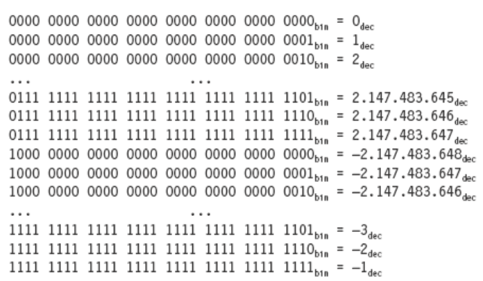

### Soma de 2 Números Binários
- Similar ao decimal. 
- O que não é representado por um dígito é passado ao dígito seguinte, como "vai-um".

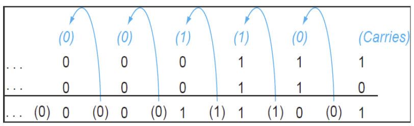

### Subtração de Inteiros
- **Negar** o segundo operando e somar.  
- Exemplo: $7 - 6 = 7 + (-6)$

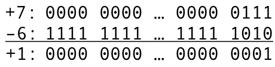

- Overflow se o resultado estiver **fora da faixa**. 
    - POS - NEG = NEG 
    - NEG - POS = POS

### Overflow

**Ocorre overflow (transbordo) se**
- Ao somar dois número de **mesmo sinal**: Sinal do resultado é **diferente** dos operandos. 
- Ao subtrair dois números de sinais **diferentes**: Equivale a **somar** dois números de **mesmo sinal**. 

**Não ocorre overflow** 
- Ao subtrair dois números de **mesmo sinal**.

> [!CAUTION]
>
> No RISC-V **não** se detecta overflow na aritmética inteira.
> - O objetivo é simplificar o hardware do processador.
> - Deteção deve ser feita por software.  

> [!NOTE] 
> 
> C x FORTRAN
> - A linguagem C não prevê a deteção de overflow em suas instruções. 
> - Fortran prevê a deteção de overflow em suas instruções 
> - MIPS gera exceção

### Aritmética para Multimídia
- Processadores **gráficos** ou de **mídia** operam com vetores de dados de 8 ou 16 bits. 
    - Usando um **somador** de 64 bits, pode-se operar: 
        - 8 bytes (8 bits);
        - 4 half words (16 bits) ou 2 words (32 bits). 
    - SIMD (single-instruction, multiple data). 

- **Aritmética com saturação** 
    - No overflow, em vez de voltar a zero, o resultado é o **valor máximo**. 
    - **Saturação** em vídeo ou áudio.

## Multiplicação

Versão Sequencial

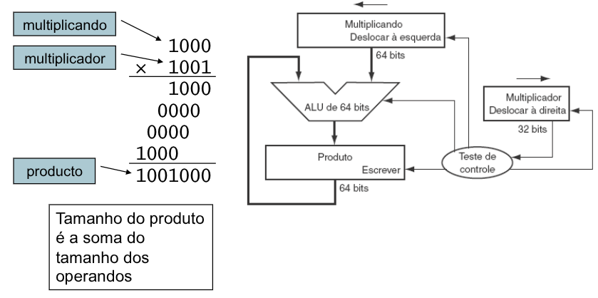

Hardware para Multiplicação

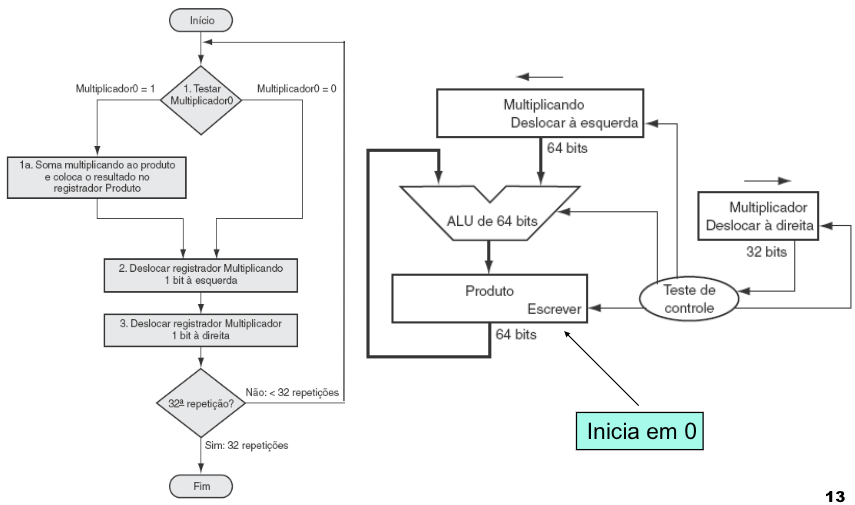

Exemplo

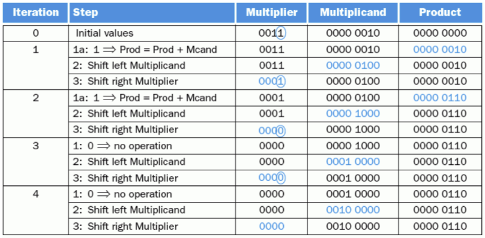

### Versão Otimizada

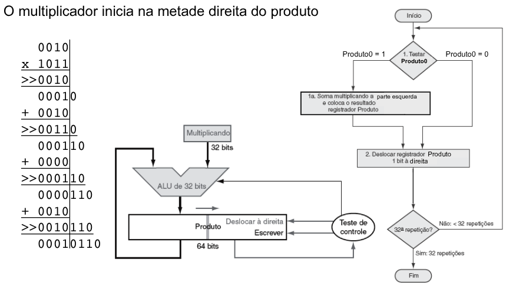

Versão Mais Rápida

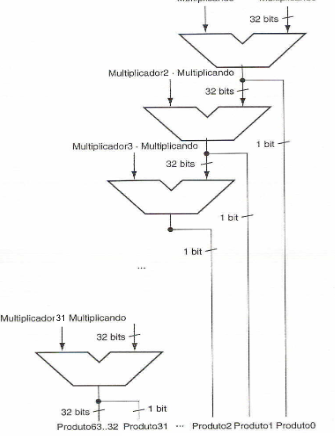

### Multiplicador Wallace-Tree
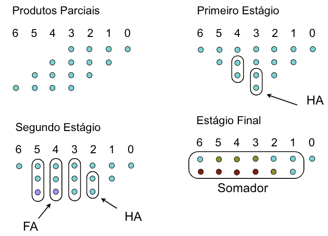

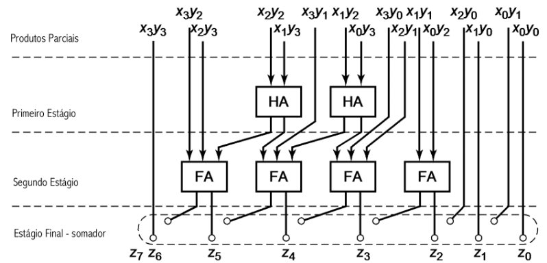

### Multiplicação no RISC-V

- `mul`: Multiplica. 
    - Retorna os 32 bits **menos significativos** do produto 
- `mulh`: Multiplica **parte alta**. 
    - Retorna os 32 bits **mais significativos** do produto, assumindo que os operandos tem sinal. 
- `mulhu`: Multiplica **parte alta sem sinal.** 
    - Retorna os 32 bits **mais significativos** do produto, assumindo que os operandos não tem sinal.
- `mulhsu`: **multiplica parte alta** com e sem sinal. 
    - Retorna os 32 bits **mais significativos** do produto, assumindo que um operando com sinal e outro sem. 

- Utiliza-se o `mulh` para **checar overflow** em 32 bits.

### Divisão

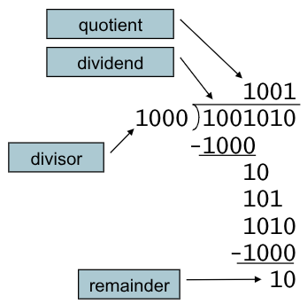

1. Verificar divisão por zero 
2. Procedimento 
    - Se divisor <= dividendo: 1 no quociente, subtrai. 
    - Senão: 0 no quociente, baixa próximo bit. 
3. Restaura 
    - Subtrai, se resto < 0, soma de novo 
4. Divisão com sinal 
    - Divide valores absolutos. 
    - Ajustar sinal do quociente e resto de acordo.

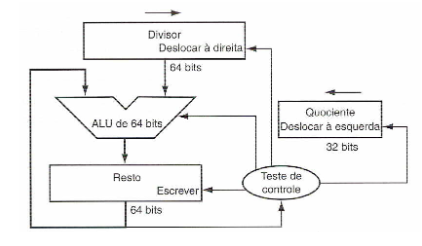

Exemplo

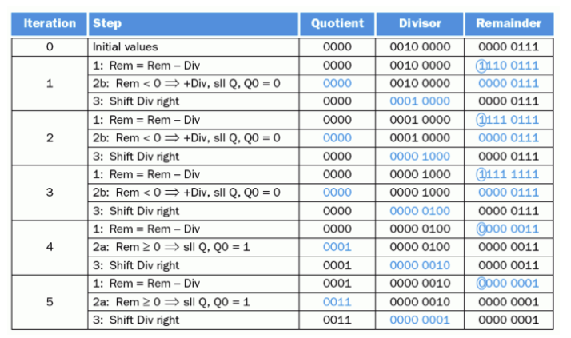

### Divisão no RISC-V

- `div, divu`: Quociente da divisão c/s sinal. 
    - Ex: `div t0,t1,t2`   
    - t0 = floor(t1/t2) 
    - **Não sinaliza erro** em caso de divisão por zero! 

- `rem, remu`: Resto da divisão c/s sinal. 
    - Ex: `rem t0, t1, t2`  
    - t0 = t1 % t2

### Multiplicação e Divisão com sinal

**Multiplicação:**  Basta verificar se os sinais do multiplicando e do multiplicador são iguais ou diferentes, definindo o sinal do produto. 

**Divisão:** Precisamos definir o sinal do quociente e do resto. 
- Dividendo = Quociente x Divisor + Resto 
- $7 \div 2 \rightarrow 7 = 3 \times 2 + 1$    
- $(-7) \div 2 \rightarrow -7 = (-3) \times 2 + (-1)$
- Ou $-7 = (-4) \times 2 + 1$    
- **Regra:** 
    - **Quociente:** Mesma regra da multiplicação. 
    - **Resto:** Mesmo sinal do Dividendo.
