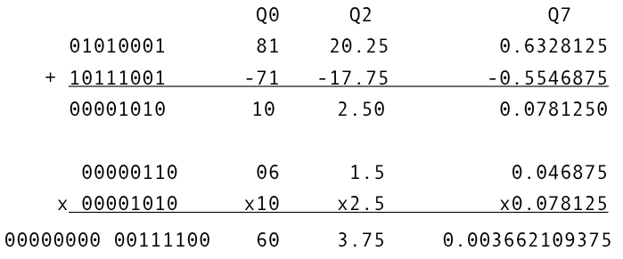
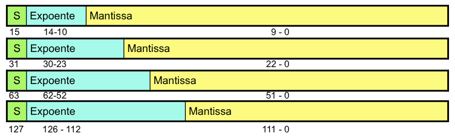
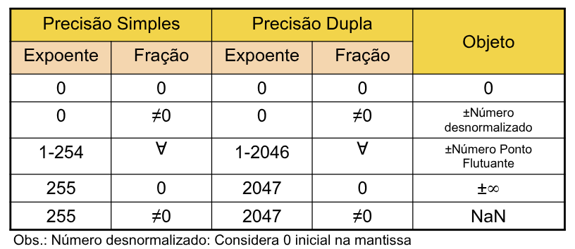
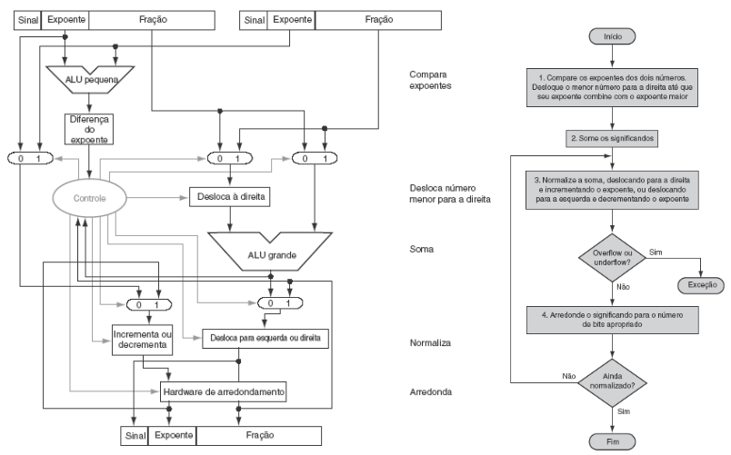
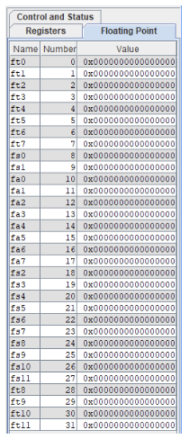

# Aritmética Fracionária

## Ponto Fixo 
Supor que o número inteiro é divido em **duas partes:** 
- Parte inteira. 
- Parte fracionária. 

A parte fracionária abrange os **bits menos significativos** e tem a seguinte representação:
- $Q_i$: $i$ bits à **direita** do número constituem a **parte fracionária**.
- $Q_3: \underbrace{b_7,b_6,b_5,b_4, b_3}_{\text{Parte Inteira}} \underbrace{b_2,b_1,b_0}_{\text{Parte Fracionária}}$

### Exemplo 01 - 8 bits
$Q_3: 2^4 \; 2^3 \; 2^2  \; 2^1 \; 2^0, 2^{-1} \; 2^{-2} \; 2^{-3}$
- **Menor Valor:** $10000000, -2^4 = -16$     
- **Maior Valor:** $01111111, 2^3 + 2^2 + 2^1 + 2^0 + 2^{-1} + 2^{-2} + 2^{-3} = 15.875$

$Q_1: 2^6 \; 2^5 \; 2^4 \; 2^3 \; 2^2 \; 2^1 \; 2^0, 2^{-1}$
- **Menor Valor:** $10000000, -2^6 = -64$ 
- **Maior Valor:** $01111111, 2^5 + 2^4 + 2^3 + 2^2 + 2^1 + 2^0 + 2^{-1} = 63.5$

$Q_7: 2^0, 2^{-1} \; 2^{-2} \; 2^{-3} \; 2^{-4} \; 2^{-5} \; 2^{-6} \; 2^{-7}$
- **Menor Valor:** $10000000, -2^0 = -1$ 
- **Maior Valor:** $01111111, 2^{-1} + 2^{-2} + 2^{-3} + 2^{-4} + 2^{-5} + 2^{-6} + 2^{-7} = 0.9921875$

### Exemplos 02
Considere 8 bits, calcule a representação em Q7:
- $ 0.75 = 01100000$
- $ -0.75 = 10100000$
- $ 0.3 = 00100110$
    - **Arredondamento** 

Considerando 16 bits, calcule a representação em Q15:
- $ 0.75 = 0110000000000000$
- $ -0.75 = 1010000000000000$
- $ 0.3 = 0010011001100110$

Operações Matemáticas: da mesma forma que inteiros usando mesmo Q.
- Soma 
- Subtração 
- Multiplicação 
- Divisão (Ex: 5/8)



Problemas: 
- Pequena **Faixa Dinâmica** 
- Precisão **depende** da faixa dinâmica 

Vantagens: 
- Aritmética é simples e rápida  
- Processador menor, mais rápido e mais barato

## Ponto Flutuante 
Representação de números **muito grandes** e **muito pequenos**. 
- 0,000000000000001182721226716 
- 167283876351200000000000000000

**Notação Científica** 
- $–2.34 \times 10^{56}$: Normalizado 
- $+0.0043 \times 10^{-7}$: Não normalizado 
- $+567.04 \times 10^3$: Não normalizado 

Tipos `float` e `double` em C.

**Padrão** de ponto flutuante IEEE 754:
- **Meia Precisão:** 16 bits $\Rightarrow$ sinal: 1, exp: 5, mantissa: 10  
- **Precisão Simples:** 32 bits $\Rightarrow$ sinal: 1, exp: 8, mantissa: 23 
- **Precisão Dupla:** 64 bits $\Rightarrow$ sinal: 1, exp: 11, mantissa: 52 
- **Precisão Quádrupla:** 128 bits $\Rightarrow$ sinal: 1, exp: 15, mantissa: 112

$$
(-1)^{\text{sinal}} \times (1 + \text{fração}) \times 2^{\text{expoente - bias}}
$$



### Padrão IEEE 754

**Normalização:** 
- $(\text{sinal}) \; 1.bbbbb \times 2^e$ 
- Sinal: 
    - 1: Negativo;
    - 0: Positivo 
- **Sempre** um bit em $1$ à **esquerda** da vírgula 
- **Expoente com deslocamento** (`expoente original + bias`). 
- $\text{Bias} = 2^{n-1} - 1$, onde $n:$ Número de bits do expoente 
- Precisão Simples: n = 8, bias = 127 
    - $\text{Expoente Original} = e - 127$ 
- Precisão Dupla: n = 11, bias = 1023 
    - $\text{Expoente Original} = e - 1023$

Exemplo: $- 0.75_{10}$
- Binário não normalizado: $-0.11$
- Normalizado: $-1.1 \times 2^{-1}$
- $\text{Expoente} = 127 - 1 = 126 = 01111110_2$ 
- Mantissa $= 1000 \ldots 00_2$
- Sinal: 1 (negativo) 
- **Precisão Simples:** $1 \; 01111110 \; 10000000000 \ldots 000$

Dado o número em FP IEEE754: `0xC1100000` qual o número decimal representado?
- 1100 0001 0001 0000 0000 0000 0000 0000 
- 1 10000010 00100000000000000000000 
- Expoente = 130 - 127 = 3 
- Mantissa: 1.001 (Lembre-se de não esquecer do 1,mantissa que sempre precisa ser representado) 

Logo: $(-1)^1 \times 1.001 \times 23 = - (1001.0) = -9$

### Precisão do Ponto Flutuante
Precisão Relativa 
- Menor **diferença** entre números **consecutivos**. 
- Simples: Aproximadamente $2^{-23}$. 
    - Equivale a $23 \times log_{10} \; 2 \simeq 23 \times 0.3 \simeq 6$ casas decimais 
- Dupla: Aproximadamente $2^{-52}$ 
    - Equivale a $52 \times log_{10} \; 2 \simeq 52 \times 0.3 \simeq 16$ casas decimais

### Limites na Representação
**Overflow:**  
- Número é muito grande para ser representado. 
- Expoente positivo, ultrapassa o limite de representação. 

**Underflow:** 
- Número é muito pequeno para ser representado. 
- Expoente negativo, ultrapassa o limite de representação.



### Número Denormalizado
- Expoente = $000 \ldots 0  \Rightarrow$ bit default é 0.

$$
x = (-1)^s \times (0 + \text{Fração}) \times 2^{-\text{bias}}
$$

- Menor que números normalizados: Estende limite do **underflow**.
- Denormalizado com **mantissa** $= 0000 \ldots 00$: Representa $\pm \; 0.0$.

### Adição no Ponto Flutuante
Para números decimais de 4 dígitos: $9.999 \times 10^1 + 1.610 \times 10^{-1}$  

1. Alinhar pontos decimais 
    - Deslocar número com menor expoente 
    - $9.999 \times 10^1 + 0.016 \times 10^1$ 
2. Somar as mantissas 
    -$ 9.999 \times 10^1 + 0.016 \times 10^1 = 10.015 \times 10^1$  
3. Normalizar resultado e verif. over/underflow 
    - $1.0015 \times 10^2$ 
4. Arredondar e renormalizar se preciso 
    - $1.002 \times 10^2$

Para Considerar números binários de 4 dígitos: $1.000_2 \times 2^{-1} + -1.110_2 \times 2^{-2}  (0.5 + -0.4375)$ 
1. Alinhar pontos binários 
    - Deslocar número com menor expoente 
    - $1.000_2 \times 2^{-1} + -0.1110_2 \times 2^{-1}$ 
2. Somar as mantissas 
    - $1.000_2 \times 2^{-1} + -0.1110_2 \times 2^{-1}  = 0.001_2 \times 2^{-1}$  
3. Normalizar resultado e verif. over/underflow 
    - $1.000 \times 2^{-4}$ 
4. Arredondar e renormalizar se preciso. 
    - $1.000 \times 2^{-4} = 0.0625$

- Muito mais complexa que adição de inteiros. 
- Executar todo o procedimento em um ciclo de relógio iria requerer um **período muito grande**. 
    - Relógio mais lento impactaria todo o processador. 
- Usualmente realizada em vários ciclos de relógio. 
- Poderia executar em ***pipeline***. 



### Multiplicação no Ponto Flutuante
Para números decimais de 4 dígitos: $1.110 \times 10^{10} \times 9.200 \times 10^{-5}$ 

1. Somar expoentes (subtrair bias, se houver) 
    - $10 + - 5 = 5$ 
2. Multiplicar mantissas 
    - $1.110 \times 9.200 = 10.212  \Rightarrow 10.212 \times 10^5$ 
3. Normalizar resultado e tratar estouro 
    - $1.0212 \times 10^6$ 
4. Arredondar e renormalizar, se necessário 
    - $1.021 \times 10^6$ 

- Determinar o sinal do resultado em função dos operandos

Para números binários de 4 dígitos: $1.000 \times 2^{-1} \times - 1.110 \times 2^{-2} $

1. Somar expoentes (subtrair bias, se houver) 
    - Sem bias: $-1 + -2 = -3$ 
    - Com bias: $(-1 + 127) + (-2 + 127) = -3 + 254 -127 = -3 + 127$ 
2. Multiplicar mantissas 
    - $1.000 \times 1.110 = 1.110 \Rightarrow 1.110 \times 2-3$ 
3. Normalizar resultado e tratar estouro 
    - $1.110 \times 2^{-3}$ 
4. Arredondar e renormalizar, se necessário 
    - $1.110 \times 2^{-3}$ 
5. Determinar o sinal do resultado em função dos operandos 
    - -$1.110 \times 2^{-3}$

### Ponto Flutuante: Arredondamento
O IEEE 754 permite 4 tipos de arredondamentos 
- Sempre para $+\infty$ (cima, ***ceil***): $2.11 \Rightarrow 2.2, \; 2.15 \Rightarrow 2.2, \; 2.19 \Rightarrow 2.2$ 
- Sempre para $-\infty$ (baixo, ***floor***): $2.11 \Rightarrow 2.1, \; 2.15 \Rightarrow 2.1, \; 2.19 \Rightarrow 2.1$ 
- **Truncamento:** **Despreza** os bits **menos significativos** 
    - $+1.01101 = 1.40625 \Rightarrow +1.011 = 1.375$          
- Ao mais próximo (***round***): $2.11 \Rightarrow 2.1, \; 2.19 \Rightarrow 2.2$
    - 2.15 ? 
    - Estatisticamente **Coerente**: 
        - Ao dígito par: $2.15 \Rightarrow 2.2 \; 2.25 \Rightarrow 2.2$

> [!NOTE]
> 
> Em precisão limitada: $(x + y) + z \neq x + (y + z)$

### Ponto Flutuante no RISC-V: RV32IMFD
- F e D são extensões da ISA para **ponto flutuante simples** e **duplo**. 
- São adicionados 32 novos Registradores novos registradores de precisão simples/dupla: `f0, f1,.., f30, f31`.



Permite operações com precisão simples e dupla
- **Adição:** `fadd.s` e `fadd.d` 
- **Subtração:** `fsub.s` e `fsub.d`   
- **Multiplicação:** `fmul.s` e `fmul.d`    
- **Divisão:** `fdiv.s` e `fdiv.d`   

```asm
fadd.s f0, f1, f2
fsub.d f0, f2, f4
fmul.s  f0, f1, f2
div.d  f0, f4, f8
```

**Comparação:**  
```asm
feq.s t1, f1, f2   # t1 = (f1 == f2) ? 1 : 0 
fle.s  t1, f1, f2  # t1 = (f1 <= f2) ? 1 : 0 
flt.s  t1, f1, f2  # t1 = (f1 < f2) ? 1 : 0 
fmax.s f0, f1, f2  # f0 = (f1 > f2) ? f1 : f2 
fmin.s f0, f1, f2  # f0 = (f1 < f2) ? f1 : f2
```

**Acesso à memória** 
```asm
flw f0, 0(s0)   # f0 = mem[s0 + 0] 
fsw f1, 4(s0)   # mem[s0 + 4] = f1 
```

**Movimentação de dados** 
```asm
mv.x.s t0, f0   # t0 = f0 
mv.s.x f1, t1   # f1 = t1 
```

**Conversão de dados** 
```asm
fcvt.s.w f0, t0   # f0 = (float)t0 
fcvt.s.wu f0, t0  # f0 = (float)(unsigned)t0 
fcvt.w.s t0, f0   # t0 = (int)f0 
fcvt.wu.s t0, f0  # t0 = (unsigned)f0
```

### Exemplo: Conversor de Temperatura
```c
float fahr2c(float fahr) 
{ 
    return 5.0 * (fahr - 32.0) / 9.0; 
}
```

```asm
.data 
    const5:   .float 5.0 
    const9:   .float 9.0 

.text 
fahr2c: 
    la t0, const5  
    flw ft0, 0(t0)  # ft0 = 5.0  
    flw ft1, 4(t0)  # ft1 = 9.0  
    
    li t0,32  
    fcvt.s.w ft2, t0 # Não requer acesso à memória de dados!!!  
    fsub.s fa0, fa0, ft2 # (fahr - 32.0) 
    fmul.s fa0, fa0, ft0 # (fahr - 32.0) * 5 
    fdiv.s fa0, fa0, ft1 # ((fahr - 32.0) * 5) / 9
    ret
```

### Complexidades do Ponto Flutuante
- As operações aritméticas são mais complexas. 
- Além do ***overflow*** podemos ter ***underflow***. 
- A precisão pode ser um grande problema. 
    - O IEEE 754 mantém **dois bits extras**, guarda e **arredondamento**. 
    - Vários modos de arredondamento. 
    - Permite ajustar o comportamento numérico. 
- Nem todas unidades de FP implementam tudo. 
    - A maioria das linguagens e bibliotecas de FP usam apenas opções padrão;

### Observação
- A aritmética de computador é restrita por uma **precisão limitada**. 
- Os padrões de bit não têm um significado inerente mas **existem padrões**: 
  - Complemento de dois 
  - ponto flutuante IEEE 754 
- As instruções de computador determinam o "significado" dos padrões de bit. 
- O desempenho e a precisão são importantes; portanto, existem muitas complexidades nas máquinas reais. 
- A escolha do algoritmo é importante e pode levar a **otimizações de hardware** para espaço e tempo (por exemplo, multiplicação).
