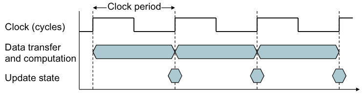
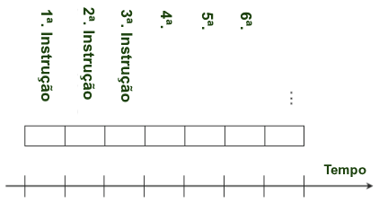

# Desempenho

- Medir, resumir e informar. 
- Fazer escolhas inteligentes. 
- Ver através da propaganda de marketing. 
- Vital para entender a motivação organizacional subjacente.

## Como Medir o Desempenho
- **Tempo** 
- **Potência** 
- Custo 
- Portabilidade (peso, tamanho, ...) 
- Robustez (queda, água, ...) 
- Irradiação

$$
\text{Potência} = \text{Capacitância} \times \text{Voltagem}^2 \times \text{Frequencia}
$$ 

### Exemplo: Reduzindo Potência 
Suponha uma nova CPU com $85\%$ da carga capacitiva da antiga e $15\%$ de redução na tensão e na frequência. Qual a redução de potência obtida ?

$$
\frac{P_{\text{new}}}{P_{\text{old}}} = \frac{ C_{\text{old}} \times 0.85 \times {V_{\text{old}} \times 0.85} ^2 \times F_{\text{old}} \times 0.85 }{ C_{\text{old}} \times V_{\text{old}}^2 \times F_{\text{old}} } = 0.85^4 = 0.52 
$$

**A barreira da potência** 
- Não se pode reduzir mais a potência. 
- Não se consegue melhorar a redução de calor. 

Para melhorar ainda o desempenho pode-se utilizar o **Paralelismo**.

## Tempo de Resposta e Vazão

### Tempo de resposta (latência) 
- Quanto **tempo** leva-se para **realizar** uma tarefa. 

### Vazão (throughput) 
- Quantas **tarefas/transações** a máquina pode realizar em um intervalo de tempo. 
- Velocidade de **execução média**. 
- Como tempo e vazão são afetados por: 
    - Substituição do processador por um mais rápido. 
    - Acrescentar mais processadores. 
- Foca-se em **tempo de resposta**.

## Desempenho Relativo
Para um programa sendo executado na máquina $X$:

$$
\text{Desempenho}_X  = \frac{1}{\text{Tempo de Execução}_X}   
$$

**Fator de Desempenho**: "$X$ é $n$ vezes mais rápido do que $Y$":

$$
n = \frac{\text{Desempenho}_X}{\text{Desempenho}_Y} =  \frac{\text{Tempo de Execução}_Y}{\text{Tempo de Execução}_X}  
$$

### Exemplo: 
- A máquina A executa um programa em 10 segundos 
- A máquina B executa o mesmo programa em 15 segundos 

Qual o fator de desempenho de A em relação a B?

$$
n = \frac{\text{Tempo de Execução}_B}{\text{Tempo de Execução}_A} = \frac{15}{10} = 1.5
$$

## Medindo o Tempo de Execução

**Tempo Decorrido** 
- Tempo total (E/S, execução de outros programas, etc.). 
- Determina o **desempenho do sistema**.

**Tempo de CPU** 
- Tempo gasto executando um trabalho. 
    - Não conta E/S nem outros trabalhos 

- Pode ser dividido em: 
    - Tempo de CPU de sistema. 
    - Tempo de CPU de usuário. 
    - Diferentes programas são afetados de forma diferente pelo desempenho da CPU e do Sistema. 

- **Foco:** Tempo de CPU do usuário.

## Relógio da CPU
Operações da CPU acionadas por um relógio (***clock***).

**Período do Relógio:** Duração do ciclo. 
- Ex: $500 \ ps = 0.5 \ ns = 500 \times 10^{-12} s$ 

**Frequência do Relógio:** ciclos por segundo. 
- Ex: $4.0 \text{ GHz} = 4000 \text{ MHz} = 4.0 \times 10^9 \ Hz$

### Tempo de CPU

$$
\text{Tempo de CPU} = \text{Ciclos CPU} \times \text{Tempo de Ciclo} \\

[\frac{\text{segundos}}{\text{programa}}] = [\frac{\text{ciclos}}{\text{programa}}] \times [\frac{\text{segundos}}{\text{ciclos}}]
$$

- Melhorar o Desempenho = Diminuir o tempo de CPU
    - Diminuir o número de ciclos necessários para um programa, ou 
    - Diminuir o tempo de ciclo de clock ou, dito de outra maneira,
    - Aumentar a frequência de clock.

- $\text{Frequência} = 1 / \text{Período}$
    - Ex: $F = 4$ GHz
    - $P = \frac{1}{F} = \frac{1}{4 \times 10^9} = 250 \times 10^{-12} = 250 \ ps$ 

Quantos ciclos são necessários para um programa ?
- Poderíamos considerar que o número de ciclos é igual ao número de instruções do programa?
- Essa **suposição é geralmente incorreta**; diferentes instruções geralmente levam a diferentes períodos em diferentes máquinas.

Diferentes números de ciclos para diferentes instruções
- A multiplicação **leva mais tempo** do que a adição. 
- As operações de ponto flutuante levam mais tempo do que as operações de inteiros. 
- Acessar a memória leva mais tempo do que acessar os registradores. 
- **Importante:** Mudar o tempo de ciclo normalmente muda o número de ciclos necessários para várias instruções.

## Número de Instruções e CPI
Número de Instruções: 
- Determinado pelo **programa, compilador e ISA** 
- **Número de instruções do programa** $\neq$ **número de instruções executadas !!!** 

Número de Ciclos por Instrução 
- O hardware da CPU determina quantos ciclos uma instrução leva para executar. 
- Ex: no RiscV multiciclo `add` leva 4 ciclos para executar.

CPI de um Programa 
- **Média de ciclos por instrução** para o programa. 
- Depende da combinação de instruções utilizada no programa.

### Exemplo - Frequência
Computador A:
- Relógio de $4 \text{ GHz}$. 
- Leva 10 segundos para compilar um programa X. 

Computador B:
- Objetivo: Compilar X em 6 segundos. 
- Pode-se aumentar a frequência de relógio,com o custo aumentar em $20\%$ o número de ciclos necessários para a tarefa.

$$
F_B = \frac{\text{Ciclos}_B}{\text{Tempo}_B} = \frac{1.2 \times \text{Ciclos}_A}{6 \ s}\\ 
\text{Ciclos}_A = \text{Tempo}_A \times F_A = 10 \ s \times 4 \times 10^9 = 40 \times 10^9 \\
F_B = \frac{1.2 \times 40 \times 10^9 }{6 \ s} = 8 \text{ GHz} 
$$

> [!NOTE]
>
> Se duas máquinas possuem a mesma **ISA** (Arquitetura do Conjunto de Instruções) será sempre idêntica o número de instruções.

## Equação Básica

$$
T_\text{CPU} = IC \times CPI \times P
$$

- $IC$: Número de **instruções executadas** pelo programa. 
- $CPI$: Número **médio de ciclos** por instrução. 
- $P$: Tempo em segundos por ciclo de relógio. 

Analogamente,
$$
T_\text{CPU} = \frac{IC \times CPI}{F}
$$

- Tempo Médio por Instrução: $CPI \times P = \frac{\text{segundos}}{\text{instrução}}$
- **Taxa de Execução:** $\frac{1}{CPI \times P} = \frac{\text{instruções}}{\text{segundos}}$

### Exemplo - CPI
- Computador A: Período Rel = $250 \ ps$, $CPI = 2.0$.  
- Computador B: Período Rel = $500 \ ps$, $CPI = 1.2$. 
- Mesma ISA, mesmo programa. Logo, $I_A = I_B$. 

$$
T_A = I_A \times CPI_A \times P_A \\
T_B = I_B \times CPI_B \times P_B, \text{ Logo} \\
T_B = \frac{T_A}{CPI_A \times P_A} \times CPI_B \times P_B \\
T_B = T_A \times 1,2 
$$

A máquina A é 20% mais rápida.

### O que Afeta a CPI ?
| Componente              | Afeta o quê?                                  | Como?                                      |
| :---------------------: | :-------------------------------------------: |:----------------------------------------: |
| Algoritmo               | Contagem de Instruções e possivelmente CPI    | Número e tipo de instruções                |
| Linguagem de Programação| Contagem de Instruções e CPI                  | Instruções da linguagem são traduzidas para instruções do processador |
| Compilador              | Contagem de Instruções e CPI                  | Eficiência do compilador                   |
| Conjunto de Instruções  | Contagem de Instruções, frequência de clock e CPI | Afeta os 3 aspectos do desempenho       |

### CPI em Detalhe
Podemos dividir as instruções em **n classes** em função do número de ciclos
$$
\text{Ciclos Rel} = \sum_{i = 1}^n (CPI_i \times \text{Total Instr}_i)
$$

Média ponderada do CPI
$$
CPI = \frac{\text{Ciclos Rel}}{\text{Total Instr}} = \sum_{i = 1}^n (CPI_i \times \frac{\text{Total Instr}_i}{\text{Total Instr}})
$$

### Comparando Segmentos de Código
Duas sequências de código usando três classes diferentes de instruções: Classe A, Classe B e Classe C.

| Classes       | A | B | C |
|---------------|---|---|---|
| CPI para classe | 1 | 2 | 3 |
| IC na sequência 1 | 2 | 1 | 2 |
| IC na sequência 2 | 4 | 1 | 1 |

- Sequência 01: $\frac{1 \times 2 + 2 \times 1 + 3 \times 2}{5} = \frac{10}{5} = 2.0$
- Sequência 02: $\frac{1 \times 4 + 2 \times 1 + 3 \times 1}{5} = \frac{9}{6} = 1.5$
    - Dividimos pela soma dos pesos, ou seja, pela soma da quantidade de vezes que aparece cada classe de instrução.

## Unidade de Medida: MIPS
- Milhões de Instruções Por Segundo (nativo).

$$
MIPS = \frac{\text{Contador de Instruções}}{\text{Tempo de Execução}} = \frac{1}{10^6} 
$$

- **Vantagem:** 
    - Fácil de entender.  
    - Um computador é capaz de processar  100 MIPS é mais rápido que outro de 50 MIPS.

- **Desvantagem:**
    - Não leva em consideração a capacidade das instruções. 
    - O MIPS varia entre programas no mesmo processador. 
    - O MIPS pode variar inversamente com o desempenho!

> [!CAUTION]
>
> Cuidar com as medidas x FLOPS 
> - Que embora sejam mais precisas ainda podem incorrer em erros

### Exemplo de MIPS
Dois compiladores diferentes estão sendo testados para uma máquina de 
$4 \text{GHz}$ com três classes diferentes de instruções: Classe A, Classe B e Classe 
C, e elas exigem **um, dois e três ciclos, respectivamente**. 
- Ambos os compiladores são usados para produzir código para um grande software. 
  
O código do primeiro compilador usa 5 bilhões de instruções da Classe A, 1 
bilhão de instruções da Classe B e 1 bilhão de instruções da Classe C. 
- $CPI = \frac{5 + 2 + 3}{7} = \frac{10}{7} = 1.43$
- $T = \frac{CPI \times I}{F} = \frac{1.43 \times 7 \times 10^9}{4 \times 10^9} = 2.5 \ s$.

O código do segundo compilador usa 10 bilhões de instruções da Classe A, 1 
bilhão de instruções da Classe B e 1 bilhão de instruções da Classe C. 
- $CPI = \frac{10 + 2 + 3}{12} = \frac{15}{12} = 1.25$
- $T = \frac{CPI \times I}{F} = \frac{1.25 \times 12 \times 10^9}{4 \times 10^9} = 3.75 \ s$.

Que sequencia será mais rápida de acordo com o MIPS (lembrar grandezas)? 
- O segundo compilador

Que sequência será mais rápida de acordo com o tempo de execução?
- O primeiro compilador
