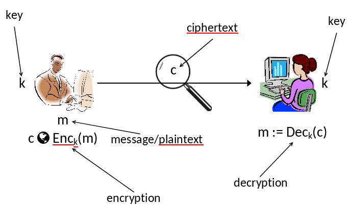
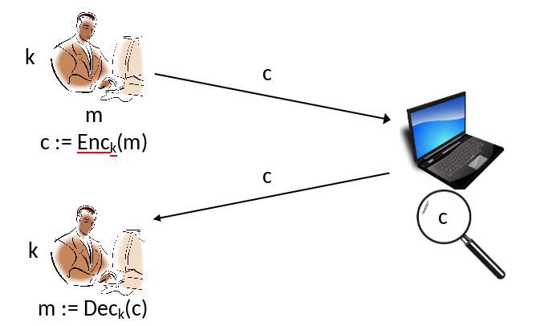
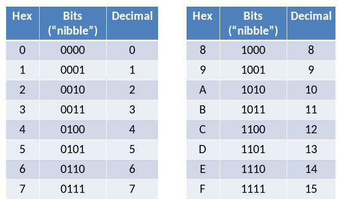
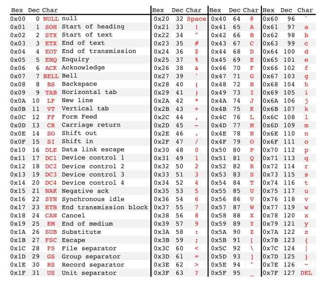
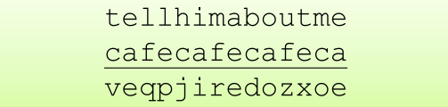
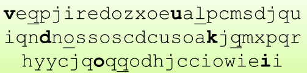
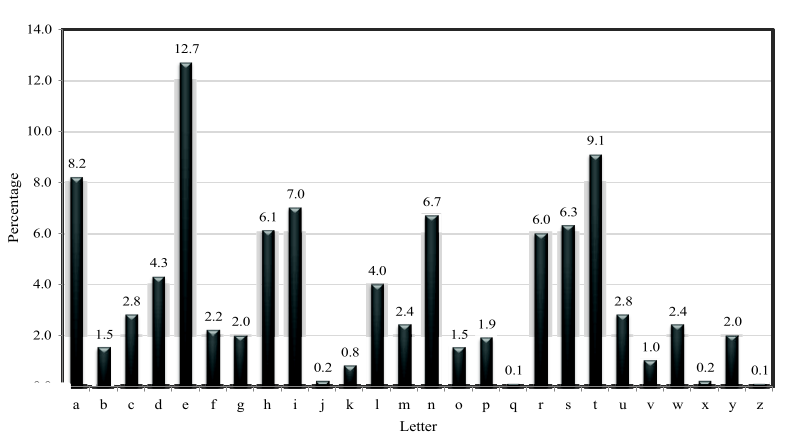

# Criptografia

##  Criptografia Histórica

- "…a arte de escrever ou decifrar códigos…".
- Focava exclusivamente em garantir **comunicação privada** entre duas partes que compartilham **informações secretas** previamente, usando *“códigos”*.
  -  Criptografia de **chave privada**.

- Projetos Heurísticos
- Sem princípios rigorosos
- Esquemas eram propostos, quebrados, e repetidos…
- Usado principalmente para  aplicações **militares/governamentais**, com alguns usos específicos na indústria (Ex.: bancos)

## Criptografia Moderna

- Escopo muito mais amplo!
  - Integridade de dados,  Autenticação, Protocolos, ...
  - Criptografia de chave pública;
  - Comunicação em grupo;
  - Modelos de confiança mais complexos;
  - **Fundamentos:** Teoria dos números, Resistência quântica e até sistemas como Votação Eletrônica, Blockchain, Criptomoedas.

- **Definição:** Projeto, análise e implementação de **técnicas matemáticas** para <u>proteger informações</u>, <u>sistemas</u> e computações <u>distribuídas</u> contra ataques adversários.

- Hoje é muito mais uma ciência:
  - Análise rigorosa;
    Fundamentos sólidos;
  - Entendimento mais profundo;
  - Teoria rica

- A *"crypto mindset"* (mentalidade criptográfica) se espalhou para outras áreas da segurança:
  - Modelagem de ameaças;
  - Provas de segurança.

- A criptografia está em todo lugar!
  - Autenticação baseada em senha, Hash de senhas;
  - Transações seguras com cartão de crédito;
  - WiFi criptografado;
  - Criptografia de disco;
  - Atualizações de software assinadas digitalmente;
  - Bitcoin;
  - ...

## Estrutura Geral

|                   |          **Segredo**          |           **Integridade**            |
| :---------------: | :---------------------------: | :----------------------------------: |
| **Chave Privada** | Criptografia de chave privada | Códigos de autenticação de mensagens |
| **Chave Pública** | Criptografia de chave pública |         Assinaturas Digitais         |

- **Blocos fundamentais:**
  - Geradores (de números) <u>pseudoaleatórios</u>.
  - Funções <u>pseudoaleatórias</u> cifras de bloco.
  - Funções **hash**.
  - Teoria dos números.

## Criptografia Clássica

- Focada exclusivamente em garantir o <u>sigilo da comunicação</u>, ou seja, **criptografar (encryption).**
- Dependia de uma **informação secreta** (`chave`) compartilhada <u>previamente</u>.
- Criptografia de **Chave Privada** (Secreta, Compartilhada, Simétrica).

### Criptografia de Chave Privada





- Um esquema de criptografia é definido por uma **mensagem** de espaço $M$ e **algoritmos** ($Gen$, $Enc$, $Dec$):
  - $Gen$ (Algoritmo de Geração de Chave): Gera como saída uma chave $k \in K$.
  - $Enc$ (Algoritmo de Criptografia): Recebe uma chave $k$ e uma mensagem $m \in M$; e gera como saída um **texto cifrado** (*ciphertext*) $c$.
    $$c \leftarrow Enc_k(m)$$
  - $Dec$ (Algoritmo de Descriptografia): Recebe uma chave $k$ e um **texto cifrado** (*ciphertext*) $c$ como entrada e retorna como saída $m$ ou um "erro".
    $$m := Dec_k(c)$$

> [!IMPORTANT]
>
> Para todo $m \in M$ e $k$ e gerado como saída por $Gen$; $Dec_k(Enc_k(m)) = m$. 
>

### Princípio de Kerckhoffs

- O esquema de criptografia **não é secreto**.
  - O atacante conhece o algoritmo.

- O único segredo é a **chave**.
  -  Ela deve ser <u>aleatória</u> e mantida em <u>segredo</u>.

- Argumentos a favor:
  - Mais fácil <u>esconder</u> a **chave** do que o **algoritmo**;
  - Mais fácil <u>trocar</u> a **chave** do que o **algoritmo**;
  - **Padronização**:
    - Facilidade de uso;
    - Revisão pública.

## *Shift Cipher* - Cifra de Deslocamento

-  Considere criptografar texto em inglês:
   -  $'a' \rightarrow 0, 'b' \rightarrow 1, \ldots, 'z' \rightarrow 25$.
   -  $k \in K = \{0, \ldots, 25\}$. 

-  Para **criptografar**: 
   -  Desloca cada letra do texto em $k$ **posições** (com retorno circular).

-  Para **Descriptografar**:
   -  Faça o processo inverso, retorne $k$ **posições** (com retorno circular).


### Aritmética modular

- $x \bmod N \iff N \mid x - y$, ou seja, se $N$ divide $x-y$.
- $[x \bmod N] =$ **Resto da divisão** de $x$ por $N$.
- Exemplos:
    - $25 = 35 \bmod 10$. 
    - $25 \neq [35 \bmod 10]$. 
    - $5 = [35 \bmod 10]$. 

- $M = \{ \text{Strings do alfabeto inglês minúsculo} \}$.
- $Gen$: Escolha uniforme $k \in \{ 0, \ldots, 25 \}$.
- $Enc_k(m_1, \ldots, m_t)$: Gera como **saída** $c_1, \ldots, c_t$, onde $c_i := [m_i + k \bmod 26]$.
- $Dec_k(c_1, \ldots, c_t)$: Gera como **saída** $m_1, \ldots, m_t$, onde $m_i := [c_i - k \bmod 26]$.

### Cifra de Deslocamento é Segura ?

- Não, somente 26 chaves são possíveis!
    - Dado um **texto cifrado** (*ciphertext*), tente <u>descriptografá-l</u>o com **todas** as chaves possíveis.
    - Some uma possibilidade "faz sentido".

-  Ataque de **força bruta** (*brute force*) ou ataque de **busca-exaustiva** (*exhaustive-search*).

- Exemplo: Ciphertext: uryybjbeyq
- Tente todas as chaves possíveis ...
  ```
  tqxxaiadxp
  spwwzhzcwo
  …
  helloworld
  ```

> [!NOTE]
>
> **Questão:** Usando a **cifra de deslocamento (shift cipher) em inglês**, qual é a criptografia de **“good”** utilizando a chave **‘b’**?
>
> a. XYYD  
> **b. HPPE**  
> c. QRST  
> d. GNNE 

> [!NOTE]
>
> **Questão:** Usando a **cifra de deslocamento (shift cipher) em inglês**, qual dos seguintes textos em claro (**plaintexts**) pode corresponder ao texto cifrado (**ciphertext**) **AZC**?
>
> a. can  
> **b. bad**  
> c. dog  
> d. run

## *Byte-wise Shift Cipher* - Cifra de Deslocamento byte a byte

- Usa `bytes` em vez de **letras**.
    - Funciona para qualquer tipo de dado.

- Substitui soma modular por `XOR`.
    - Propriedades principais continuam válidas.

- Caracteres, frequentemente, são representados pela tabela `ASCII`.
    - `1 byte/char` = `2 hex digits/char`. 


#### Hexadecimal



- 0x10
    - $= 16 × 1 + 0 = 16$
    - $= 0001 0000$
- 0xAF
    - $= 16 × A + F = 16 × 10 + 15 = 175$
    - $= 1010 1111$



- **Observações:**
    - Existem apenas 128 caracteres ASCII válidos (128 bytes são inválidos)
    - Apenas o intervalo 0x20–0x7E é imprimível
    - O intervalo 0x41–0x7A inclui letras maiúsculas e minúsculas
        - Letras maiúsculas começam com 0x4 ou 0x5
        - Letras minúsculas começam com 0x6 ou 0x7

- $M = \{ \text{Strings de bytes} \}$.
- $Gen$: Escolha uniforme $k \in \{ 0\text{x}00, \ldots, 0\text{x}FF \}$.
    - São 256 possíveis escolhas.
- $Enc_k(m_1, \ldots, m_t)$: Gera como **saída** $c_1, \ldots, c_t$, onde $c_i := [m_i \oplus k]$.
- $Dec_k(c_1, \ldots, c_t)$: Gera como **saída** $m_1, \ldots, m_t$, onde $m_i := [c_i \oplus k]$.

- Implementação:
```c
// read key from key.txt (hex) and message from ptext.txt (ASCII);
// output: ciphertext to ctext.txt (hex)

#include <stdio.h>

main(){
    FILE *keyfile, *pfile, *cfile;
    int i;
    unsigned char key, ch;
    
    keyfile = fopen("key.txt", "r"), pfile = fopen("ptext.txt", "r"), cfile = fopen("ctext.txt", "w");
    
    if (fscanf(keyfile, "%2hhX", &key) == EOF) printf("Error reading key.\n");
    for (i=0; ; i++){
        if (fscanf(pfile, "%c", &ch) == EOF) break;
        fprintf(cfile, "%02X", ch^key);
    }
    
    fclose(keyfile), fclose(pfile), fclose(cfile);
}
```

### Cifra de Deslocamento byte a byte é Segura ?

- **Não** — existem apenas **256 chaves possíveis!**
    - Dado um texto cifrado, tente descriptografar com **todas as chaves possíveis**
    - Se o texto cifrado for suficientemente longo, apenas um texto original irá **“fazer sentido”**

- É possível otimizar ainda mais
    - O primeiro nibble do texto original provavelmente será **0x4, 0x5, 0x6 ou 0x7** (assumindo apenas letras)
    - Sob suposições plausíveis, é possível reduzir a busca exaustiva para **26 chaves** (como?)

> [!TIP]
>
> - Mesmo que a chave tenha **256 possibilidades (1 byte)**, na prática:  
> - Letras no ASCII ocupam intervalos específicos:
>   - `A–Z` → 65–90
>   - `a–z` → 97–122  
> - Isso dá **26 letras possíveis** (ignorando maiúsculas/minúsculas ou tratando como equivalentes).
>
> - Você pode testar apenas as chaves que transformam o ciphertext em letras válidas. Ou seja:  
>   - Para cada posição, a descriptografia deve cair em `[A–Z]` ou `[a–z]`
>   - Isso elimina a maioria das 256 chaves possíveis

### Princípio de espaço de chaves suficiente

- O espaço de chaves deve ser grande o suficiente para tornar ataques por busca exaustiva **impraticáveis**.

> [!NOTE]
>
> Isso só é verdadeiro quando o **texto cifrado** é suficientemente **longo**.

## **A Cifra de Vigenère**

- A chave agora é uma **string**, não apenas um único caractere.
- Para criptografar, desloque cada caractere do texto original pela quantidade determinada pelo próximo caractere da chave.
  - Recomece (repita) a chave quando necessário.
- A descriptografia apenas **inverte o processo**.



- Tamanho do espaço de chaves?
    - Se as chaves são **strings** de <u>14 caracteres</u> sobre o alfabeto inglês, então o espaço de chaves tem tamanho $26^{14} \\approx 2^{66}$.
    - Se as chaves têm **comprimento variável**, é ainda maior…
    - Busca por **força bruta** torna-se inviável.

- A cifra de Vigenère é segura?
    - Foi considerada segura por muitos anos ...

### Atacando à Cifra de Vigenère

- Assuma uma chave de 14 caracteres
- **Observação:** a cada 14º caractere é *“criptografado”* usando o mesmo deslocamento.



- Olhando para cada 14º caractere é (quase) como olhar para um **texto cifrado** (*ciphertext*) criptografado com a **cifra de deslocamento**.
  - Embora um ataque direto por **força bruta** não funcione…
  - Por quê? Teria que testar as 14 combinações, não sendo viável.



- Observe cada 14º caractere do texto cifrado, começando pelo primeiro.
  - Chame isso de uma **"sequência" (stream)**.

- Seja $\alpha$ o caractere mais **frequente** que aparece nessa sequência.
- Muito provavelmente, $\alpha$ corresponde ao caractere mais **comum** do texto original (ou seja, **'e'**).
  - Então, supõe-se que o primeiro caractere da chave seja $\alpha$ - **'e'**.

- Repita o processo para todas as outras posições.
- Esse método é um pouco **heurístico (impreciso)**… e não utiliza toda a informação disponível.

#### Um Ataque Melhor

- Seja $p_i (0 \leq i \leq 25)$ a frequência da **i-ésima letra do alfabeto inglês** em um texto em inglês normal.
  - Pode-se calcular que $\sum {p_i}^2 \approx 0,065$.
- Seja $q_i$ a frequência observada da **i-ésima letra** em uma determinada sequência (*stream*) do texto cifrado.
- Se o deslocamento dessa sequência for **j**, espera-se que $q_{i + j} \approx 0,065$ para todo **i**.
  - Portanto, espera-se que $\sum p_i + q_{i + j} = 0,065$.
- Teste **todos** os valores possíveis de **j** para encontrar o correto.
  - Repita o processo para cada sequência (*stream*).
  - **j:** Daria qual foi o <u>deslocamento</u> e qual seria o <u>caractere</u> relativo a esse deslocamento.

#### Encontrando o tamanho da chave

- O ataque anterior **assume que conhecemos o tamanho da chave**.
  - E se **não soubermos** ?

> [!NOTE]
>
> - **Observação:** sempre é possível tentar o ataque anterior para **todos os comprimentos possíveis de chave**.
>   - O número de **comprimentos de chave** é muito menor que o número de **chaves possíveis**.

- Quando usamos o **tamanho correto da chave**, as frequências do texto cifrado $\{q_i\}$ em uma sequência serão **versões deslocadas** de $\{p_i\}$.
  - Assim, $\sum {q_i}^2 \approx \sum {p_i}^2 \approx 0,065$.
- Quando usamos um **tamanho de chave incorreto**, espera-se (heuristicamente) que as letras do texto cifrado estejam **uniformemente distribuídas**.
  - Então, $\sum {q_i}^2 \approx \sum (\frac{1}{26})^2 \approx 0,038$.
- Na prática, isso já é suficiente para encontrar o **comprimento da chave N que maximiza** $\sum {q_i}^2$.
  - Podemos verificar observando outras sequências (*streams*) também.

## *Byte-wise Vigenère Cipher* - Cifra de Vigenère por byte 

- A **chave** é uma <u>sequência de bytes</u>.
- O **texto original** também é uma <u>sequência de bytes</u>.
- Para **criptografar**, aplica-se `XOR` entre <u>cada byte</u> do **texto original** e o <u>próximo byte</u> da **chave**.
  - A chave é repetida (reiniciada) quando necessário.
- A **descriptografia** apenas **inverte** o processo (também usando XOR).

### Exemplo

- Suponha que o texto em claro seja **“Hello!”** e a chave seja $0\text{x}A1 2F$.
- **“Hello!”** em hexadecimal: $0\text{x}48 \; 65 \; 6C \; 6C \; 6F \; 21$.
- Aplicando `XOR` com a chave repetida: $0\text{x}A1 \; 2F \; A1 \; 2F \; A1 \; 2F$.
- $0\text{x}48 \oplus 0\text{x}A1$
  - $0100 \; 1000 \oplus 1010 \; 0001 = 1110 \; 1001 = 0\text{x}E9$.
- Texto cifrado: $0\text{x}E9 \; 4A \; CD \; 43 \; CE \; 0E$.

### Atacando a Variante da Cifra de Vigenère

- Como antes, há duas etapas principais:
    - Determinar o **tamanho** da chave.
    - Determinar **cada byte** da chave.
- Seja $p_i \; (\text{para } 0 \leq i \leq 255)$ a **frequência do byte i** em um texto em inglês (ASCII) normal.
    - Ou seja, $p_i = 0$ para $i < 32$ ou $i > 127$;
    - Por exemplo, $p_{97}$ é a frequência do caractere 'a'.
- Se as frequências $\{ p_i \}$ forem conhecidas, podemos usar os mesmos princípios de antes.
    - Mas e se essas frequências não forem conhecidas?

#### Determinar o Tamanho da Chave

- Se o tamanho da chave é **N**, então cada **N-ésimo caractere** do texto em claro é criptografado usando o **mesmo** “deslocamento”.
    - Se pegarmos cada N-ésimo caractere e calcularmos as frequências, obtemos os $\{ p_i \}$ em **ordem permutada**.
    - Se pegarmos cada M-ésimo caractere (**M não múltiplo de N**) e calcularmos as frequências, obtemos algo **próximo de uniforme**.
    - Não precisamos conhecer os $\{ p_i \}$ para distinguir esses dois casos!
- Para um **tamanho** de chave candidato, calcule $q_0, \ldots, q_{255}$ para a **primeira sequência** (stream) e compute $\sum {q_i}^2$.
    - Se for próximo de uniforme: $\sum {q_i}^2 \approx 256 \cdot (\frac{1}{256})^2 = \frac{1}{256}$.
    - Se for uma permutação de $p_i$: $\sum {q_i}^2 \approx \sum {p_i}^2$.
        - **Ponto-chave:** esse valor será bem maior que 1/256
- Portanto: Calcule $\sum {q_i}^2$ para **cada possível tamanho** de chave procurando pelo <u>valor máximo</u>.
- O <u>tamanho correto</u> da chave **N** deve produzir um valor alto para todas as **N sequências** (streams).

#### Determinar o i-ésimo byte da Chave

- Suponha que o tamanho da chave **N** já seja conhecido.

- Observe a **i-ésima sequência (stream)** do texto cifrado:
  - Como antes, todos os bytes dessa sequência foram gerados aplicando **XOR** entre o texto original e o **mesmo byte da chave**.

- Tente descriptografar essa sequência usando **todos os possíveis valores de byte B**.
  - Isso gera um **texto em claro candidato** para cada valor de **B**.

- Quando o valor testado **B** está correto:
  - Todos os bytes do texto original estarão entre **32 e 126** (caracteres ASCII imprimíveis).
  - A frequência do caractere **espaço (‘ ’)** deve ser alta.
  - As frequências das letras minúsculas (como fração do total de letras minúsculas) devem ser **próximas das frequências do inglês**.
  - Calcule as frequências observadas $q'_0, \ldots, q'_{25}$ (considerando <u>apenas letras minúsculas</u>) no **texto candidato**. Espera-se que:
    - $\sum q_i p'_i \approx \sum {p'_i}^2 \approx 0,065$, onde $p'_i$ **p’ᵢ** são as **frequências das letras** no inglês.
    - Na prática: Escolha o valor de **B** que **maximiza** $\sum q_i p'_i$ , respeitando as condições acima (e possivelmente outras heurísticas)

#### Tempo de Ataque

- Suponha que o **tamanho da chave** esteja entre $1$ e $L$.
  - Determinar o **tamanho da chave**: $\approx 256 \cdot L$.
  - Determinar **todos os bytes** da chave: $< 256^2 \cdot L$.
  - Busca por **força bruta** da chave: $\approx 256^L$

- O ataque é mais **confiável** à medida que o <u>comprimento</u> do texto cifrado
<u>aumenta</u>.
- O ataque ainda funciona para textos cifrados mais curtos, mas
pode ser necessário mais ajustes e intervenção manual. 

> [!IMPORTANT]
>
> - Projetar cifras seguras é difícil.    
> - A cifra de Vigenère permaneceu inviolável por muito tempo.    
> - Esquemas muito mais complexos também foram usados.  
> - Um esquema complexo não é necessariamente seguro, e todos os esquemas históricos foram quebrados.
