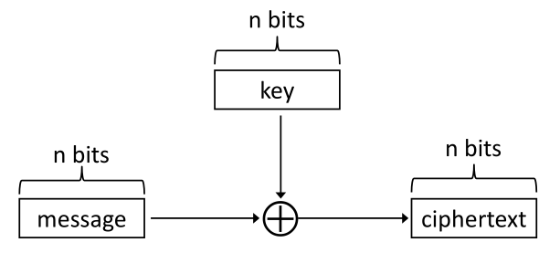

# Criptografia - Parte 02

## Criptografia Moderna

- Baseia-se em **três princípios** que sustentam a maior parte do trabalho em criptografia atualmente.

### Definições
- **Criptografia** refere-se à ciência e arte de **projetar/desenhar cifras**.
- **Criptoanálise** refere-se à ciência e arte de **quebrar as cifras**. 

- **Criptologia**, frequentemente abreviada como apenas cripto, é o **estudo de ambas**.
- A **entrada** de um processo de criptografia é comumente chamada de **texto original** (*plaintext* ou *cleartext*), e a **saída** é chamada de **texto cifrado** (*ciphertext*).

### Princípios Fundamentais

#### Princípio 1: Definições Formais

- Definições formais fornecem esse entendimento ao descrever claramente:
  - Quais ameaças estão em escopo.
  - Quais garantias de segurança são desejadas.

- É necessário **formalizar os requisitos antes de iniciar o projeto**.
- Definições permitem uma **comparação significativa entre esquemas**:
  - Um esquema que satisfaz uma definição mais fraca pode ser mais eficiente; Outro pode satisfazer uma definição mais forte.
  - Com definições precisas, podemos avaliar corretamente os **trade-offs** entre eles.

- Em geral, uma definição de segurança possui dois componentes:
  - **Garantia de segurança:**  Define o que o esquema pretende <u>impedir</u> que o atacante faça.
  - **Modelo de ataque:** Descreve o poder do adversário, ou seja, quais ações ele é <u>capaz de realizar</u>.

#### **Princípio 2: Suposições Precisas**

- A maioria das construções criptográficas modernas **não pode ser provada segura de forma incondicional**.
- Provas completas exigiriam resolver problemas da **teoria da complexidade computacional** que ainda estão em aberto.
- A criptografia moderna exige que todas as suposições sejam **explícitas** e **matematicamente precisas**.
  - É possível atribuir uma ordem de grandeza.

#### **Princípio 3: Provas de Segurança**

- Os dois princípios anteriores permitem alcançar o objetivo de fornecer uma **prova rigorosa** de que uma construção satisfaz uma definição, sob certas suposições.
- Provas são especialmente importantes porque existe um atacante tentando <u>ativamente</u> **quebrar o sistema**.
- Provas de segurança fornecem uma <u>garantia sólida</u> — **relativa às definições e suposições adotadas** — de que nenhum atacante terá sucesso.
- Nunca se deve adotar uma abordagem **não fundamentada ou puramente heurística**.
- <u>Sem uma prova</u> de que nenhum adversário com certos recursos pode quebrar o sistema, restamos apenas com **intuição**.
  - Confiar apenas na intuição em criptografia e segurança computacional pode ser **desastroso**.

## Importância das Definições
- Definições são essenciais para o **projeto**, **análise\** e uso correto da criptografia.

### Projeto (*Design*)
- Desenvolver uma definição precisa força o projetista a pensar sobre o que realmente deseja.
  - O que é essencial e (às vezes mais importante) o que não é.
  - Frequentemente revela sutilezas do problema.

> Se você não entende o que quer alcançar, como pode saber quando (ou se) alcançou?

### Análise
- Definições permitem **análise**, **avaliação** e **comparação significativas** de **esquemas**.
  - Um esquema satisfaz a definição?
  - Qual definição ele satisfaz?

> [!NOTE]
>
> **Observação:** pode haver múltiplas definições relevantes! 

- Um esquema pode ser **menos eficiente** que outro, mas ainda assim satisfazer uma definição de segurança mais forte.

### Uso
- Definições permitem que outros compreendam as **garantias de segurança** fornecidas por um esquema.
- Permitem que esquemas sejam usados como **componentes** de um <u>sistema maior</u> (**Modularidade**). 
- Permitem **substituir** um esquema por outro, desde que satisfaçam a mesma definição.

### Suposições (*Assumptions*)
- Com poucas exceções, a criptografia atualmente requer **suposições computacionais**.
  - Pelo menos até provarmos que $P \neq NP$ (e mesmo isso não seria suficiente).

- **Princípio:** Tais suposições devem ser explícitas.

#### Importância de Suposições Claras
- Permitem que pesquisadores tentem validar as suposições ao estudá-las.
- Permitem comparações significativas entre esquemas baseados em diferentes suposições.
  - Útil para entender quais são as suposições **mínimas** necessárias.

- Têm **implicações práticas** caso as suposições estejam erradas.
- Permitem **provas de segurança**.

### Provas de Segurança
- Fornecem uma **prova rigorosa** de que uma construção satisfaz uma definição sob determinadas suposições.
  - Oferecem uma garantia **sólida** (relativa à definição e às suposições!).
- São cruciais na criptografia, onde existe um atacante malicioso tentando “quebrar” o esquema.

#### Limitações?
- A criptografia ainda é, em parte, uma arte.
- Dada uma prova baseada em uma suposição, ainda precisamos instanciar essa suposição.
  - A validade dessas suposições é um tema ativo de pesquisa.

- Provas fornecem uma **garantia forte** de segurança.
  -  ... mas relativa à definição e às suposições!

- Esquemas comprovadamente seguros podem ser quebrados:
  - Se a definição **não corresponder** ao modelo de ameaça do mundo real.
    - Ou seja, se o atacante puder agir fora do modelo de segurança.
    - Isso acontece frequentemente na prática.
  - Se a suposição for **inválida**.
  - Se a implementação tiver falhas.
    - Isso também acontece frequentemente na prática.

- Isso não diminui a importância de ter **definições formais**.
- Nem a importância das provas de segurança.

## Definindo Criptografia Segura

### Definições em Criptografia

- **Garantia/objetivo de segurança:** O que queremos alcançar (ou o que queremos impedir que o atacante consiga fazer)
- **Modelo de Ameaça (*threat model*):** Quais capacidades (no mundo real) assumimos que o atacante possui.

### Relembrando

- Um esquema de criptografia de chave privada é definido por um espaço de mensagens $M$ e algoritmos $(Gen, Enc, Dec)$:

  - **Gen (Geração de Chave)**: Gera a chave $k$.
  - **Enc (Criptografia)**: Recebe a chave $k$ e uma mensagem $m \in M$; produz o ciphertext $c$
    $$
    c \leftarrow Enc_k(m)
    $$

  - **Dec (Descriptografia)**: Recebe a chave $k$ e o ciphertext $c$; produz a mensagem $m$
    $$
    m := Dec_k(c)
    $$

### **Criptografia de Chave Privada**

### Modelos de Ameaça para Criptografia

- **Ataque apenas com ciphertext (*ciphertext-only attack*)**
  - Um único ciphertext ou vários?
- **Ataque com texto conhecido (*known-plaintext attack*)**
- **Ataque com texto escolhido (*chosen-plaintext attack*)**
- **Ataque com ciphertext escolhido (*chosen-ciphertext attack)***

### Objetivos da Criptografia Segura

- Como definir o que significa um **esquema de criptografia** $(Gen, Enc, Dec)$, sobre um espaço de mensagens $M$, ser seguro?
  - Contra um ataque (simples) de *ciphertext-only*.

### Criptografia Segura ?

- **" É impossível para o atacante descobrir a chave"**
  - A chave é um **meio**, não o objetivo final.
  - Necessário (até certo ponto), mas não suficiente.
  - É fácil criar um esquema que <u>esconda totalmente a chave</u> e ainda seja **inseguro**.
  - Também é possível criar esquemas onde grande parte da chave vaza, mas ainda assim são **seguros**.

- **"É impossível para o atacante descobrir o *plaintext* a partir do *ciphertext***"
  - E se o atacante descobrir 90% do *plaintext* ? 

- **"É impossível para o atacante descobrir qualquer caractere do plaintext a partir do ciphertext"**
  - E se o atacante conseguir outras informações parciais ?
    - Exemplo: O salário é maior que $75K.
    - Pode conseguir adivinhar um caractere do *plaintext*.
  - E se o atacante acertar um caractere por sorte ?
  - Engenharia Social.

### "A Definição Correta"
- **"Independentemente de qualquer informação prévia que o atacante tenha sobre o *plaintext*, o *ciphertext* não deve revelar nenhuma informação adicional sobre o *plaintext*"**
  - Como formalizar isso?

## Sigilo Perfeito (*Perfect Secrecy*)

### Revisão de Probabilidade

- **Variável Aleatória (v.a.)**: Variável que assume <u>valores (discretos)</u> com certas probabilidades.

- **Distribuição de Probabilidade**: Especifica a probabilidade de <u>cada valor possível</u>.
   - Cada probabilidade deve estar entre 0 e 1.
   - A soma de todas as probabilidade deve ser 1.
   
- **Evento**: Ocorrência <u>específica</u> em um experimento.
  - $Pr[E]$: probabilidade do evento $E$.

- **Probabilidade Condicional**: Probabilidade de que um evento ocorra, dado que algum outro evento ocorreu.
  $$
  Pr[A \mid B] = \frac{Pr[A \cap B]}{Pr[B]}
  $$

- **Independência**: Duas variáveis $X, Y$ são independentes se:
  $$
  Pr[X = x \mid Y = y] = Pr[X = x]
  $$
  - $X,Y$: Variáveis Aleatórias.
  - $x,y$ : Valor da Probabilidade.

- **Lei da Probabilidade Total**: Digamos que $E_1, \ldots, E_n$ sejam uma <u>partição</u> de todas as possibilidades possíveis. Então, para qualquer $A$:
  $$
  Pr[A] = \sum_i Pr[A \cap E_i] = \sum_i Pr[A \mid E_i] \cdot Pr[E_i] \\
  $$

### Notação
- $K$: Espaço de Chaves, Conjunto de todas as chaves possíveis.
- $C$: Espaço de Ciphertexts, Conjunto de todos os possíveis ***ciphertexts***.

### Distribuições de Probabilidade
- Seja $M$ a variável aleatória que denota o valor da mensagem.
  - O valor de $M$ está ao longo de $\mathcal{M}$.
  - Depende do contexto!!
  - Reflete a probabilidade de mensagens diferentes serem enviadas, dado o conhecimento prévio do atacante.
- Exemplo:  
  $Pr[M = "attack\ today"] = 0.7$  
  $Pr[M = "don’t\ attack"] = 0.3$

- Seja $K$ uma variável aleatória que denota a chave.
  - $K$ está em cima de $\mathcal{K}$

- Dado um esquema de criptografia $(Gen, Enc, Dec)$.
  - O algoritmo **Gen** define uma distribuição de probabilidade para $K$:
    $$
    Pr[K = k] = Pr[Gen\text{ gera a chave } k]
    $$

- As variáveis aleatórias $M$ e $K$ são independentes.
  - Exije que as partes **não escolham** a chave com **base na mensagem**, ou a mensagem com base na chave.

### Experimento Probabilístico
- Dado um esquema $(Gen, Enc, Dec)$ e uma distribuição $M$:
- Considere o seguinte **experimento aleatório**:
  1. Gerar chave uma $k$ usando $Gen$
  2. Escolher mensagem $m$
  3. Calcular/Aplicar $c \leftarrow Enc_k(m)$

- Isso define uma distribuição de probabilidade para o ***ciphertext***!
- $C$: variável aleatória que denota o valor do ciphertext.

### Exemplo 1
Considere a seguinte cifra de deslocamento:
- $\forall k \in \{0, \ldots, 25\}, Pr[K = k] = 1/26$.
- $Pr[M = \text{`a'}] = 0.7$ e $Pr[M = \text{`z'}] = 0.3$.

Qual é o valor de $Pr[C = \text{`b'}]$ ?
- Ou $M = \text{`a'}$ e $K = 1$ ou $M = \text{`z'}$ e $K = 2$ (Quantidade de Deslocamento de 'z' até 'b'). 
$$
Pr[C = \text{`b'}] = Pr[M = \text{`a'}] \cdot Pr[K = 1] + Pr[M = \text{`z'}] \cdot Pr[K = 1] \\
= 0.7 \cdot \frac{1}{26} + 0.3 \cdot \frac{1}{26} \\
= \frac{1}{26}
$$

- Probabilidade do *ciphertext* é **igual** a probabilidade de escolher uma das chaves.

### Exemplo 2
Considere a seguinte cifra de deslocamento e a distribuição $M$ dadas por:
- $Pr[M = \text{`one'}] = 1/2$, $Pr[M = \text{`ten'}] = 1/2$

Qual é o valor de $Pr[C = \text{`rqh'}]$ ?
$$
Pr[C = \text{`rqh'}] = Pr[C = \text{`rqh'} \mid M = \text{`one'}] \cdot Pr[M = \text{`one'}] + \\
Pr[C = \text{`rqh'} \mid M = \text{`ten'}] \cdot Pr[M = \text{`ten'}] \\ 
= \frac{1}{26} \cdot \frac{1}{2} + 0 \cdot \frac{1}{2} \\
= \frac{1}{52}
$$

- A probabilidade é 0 pois se a chave **corresponder ao deslocamento** de "one" ela não pode corresponder ao deslocamento para "ten".
- Poderia ser ao contrário também.

### Algumas Definições
- **Modelos de Segurança**: Modelos de segurança buscam <u>formalizar</u> a ideia de que uma cifra é “boa”.
  - **Sigilo Perfeito (Perfect Secrecy)**: Dado qualquer texto cifrado, todos os possíveis textos em claro daquele tamanho são <u>igualmente prováveis.</u>
  - **Segurança Concreta (Concrete security)**: Quando queremos saber quanto trabalho real um adversário precisa realizar.
  - **Indistinguibilidade (Modelo Padrão)**: Propriedades **específicas** de uma cifra que nos interessam.
    - Ex: A maioria dos sistemas de cifra **não esconde** o <u>comprimento</u> de uma mensagem, então não podemos definir uma **cifra** como segura apenas exigindo que um adversário <u>não consiga distinguir textos cifrados correspondentes a duas mensagens</u>; 
    - Precisamos ser mais explícitos e exigir que o adversário não consiga distinguir entre duas mensagens $M1$ e $M2$ de mesmo comprimento.
  - **Modelo de Oráculo Aleatório (random oracle model)**: Trata uma função como uma caixa-preta que retorna uma **saída perfeitamente aleatória** e **imprevisível** para cada entrada única.

### Sigilo Perfeito (Informal)
- O *ciphertext* não deve revelar nenhuma **informação adicional** sobre o *plaintext*.
- O <u>conhecimento</u> do atacante **não muda** após ver o *ciphertext*.
- Informação do atacante sobre o *plaintext* = distribuição de $M$ conhecida pelo atacante.
- Sigilo perfeito significa que observar o *texto cifrado* **não** deve **alterar o conhecimento** do atacante sobre a distribuição de $M$.

### Sigilo Perfeito (Formal)

Um **esquema de criptografia** $(Gen, Enc, Dec)$, com <u>espaço de mensagens</u> $M$ e <u>espaço de textos cifrados</u> $C$, é perfeitamente seguro se:

- $\forall \text{ distribuição sobre } \mathcal{M}, \text{todo } m \in \mathcal{M} \text{ e todo } c \in \mathcal{C} \text{ com } Pr[C = c] > 0$, então: 

$$
Pr[M = m \mid C = c] = Pr[M = m]
$$

- Ou seja, observar o *ciphertext* **não** altera a **distribuição da mensagem** $M$.

### Exemplo 3
Considere a cifra de deslocamento (shift cipher) e a distribuição:
- $Pr[M = \text{`one'}] = \frac{1}{2}, Pr[M = \text{`ten'}] = \frac{1}{2}$

Tome $m = \text{`ten'}$ e $c = \text{`rqh'}$

$$
Pr[M = \text{`ten'} \mid C = \text{`rqh'}] = \text{ ?} \\
= 0 \\
\neq Pr[M = “ten”]
$$

### Teorema de Bayes

$$
Pr[A \mid B] = \frac{Pr[B \mid A] \cdot Pr[A]}{Pr[B]}
$$

### Exemplo 4

- Cifra de deslocamento (*shift cipher*):
  - $Pr[M = \text{``hi''}] = 0.3$
  - $Pr[M = \text{``no''}] = 0.2$  
  - $Pr[M = \text{``in''}] = 0.5$  

- Calcular: $Pr[M = \text{``hi''} \mid C = \text{``xy''}] = \text{ ?}$
$$
\frac{Pr[C = \text{``xy''} \mid M = \text{``hi''}] \cdot Pr[M = \text{``hi''}]}{Pr[C = \text{``xy''}]} \\
$$

- $Pr[C = \text{``xy''} \mid M = \text{``hi''}] = \frac{1}{26}$ 

$$
Pr[C = \text{``xy''}] \\ 
= Pr[C = \text{``xy''} \mid M = \text{``hi''}] \cdot 0.3  + Pr[C = \text{``xy''} \mid M = \text{``no''}] \cdot 0.2  + Pr[C = \text{``xy''} \mid M = \text{``in''}] \cdot 0.5  \\
= \frac{1}{26} \cdot 0.3 + \frac{1}{26} \cdot 0.2 + 0 \cdot 0.5  
= \frac{1}{52}  
$$

- $Pr[M = \text{``hi''}  \mid C = \text{``xy''}] = \text{ ?}$  
$$
= \frac{Pr[C = \text{``xy''}  \mid M = \text{``hi''}] \cdot Pr[M = \text{``hi''}]}{Pr[C = \text{``xy''}]} \\ 
= \frac{ \frac{1}{26} \cdot 0.3 }{ \frac{1}{52} } \\
= 0.6 \\ 
\neq Pr[M = \text{``hi''}]
$$

### Conclusão
- A cifra de deslocamento (shift cipher) **não é perfeitamente secreta/segura!**
  - Pelo menos não para mensagens de 2 caracteres. 

## One-Time Pad
- Criado por **Gilbert Vernam** em 1917.
  - Pesquisas históricas recentes indicam que foi inventado (pelo menos) 35 anos antes.  
- Provado como perfeitamente seguro por **Claude Shannon (1949)**.

### Definição
- Seja $M = \{0,1\}^n$
- $Gen:$ Escolhe uma chave uniforme $k \in \{0,1\}^n$.
- **Criptografia:** $ Enc_k(m) = k \oplus m $
- **Descriptografia:** $ Dec_k(c) = k \oplus c $

### Correção
$$
Dec_k(Enc_k(m)) = k \oplus ( k \oplus m) \\
= (k \oplus k) \oplus m = m \\
\text{Logo, }Dec(Enc(m)) = m
$$

### Segurança do One-Time Pad

- Note que qualquer *ciphertext* observado pode corresponder a **qualquer mensagem**.   
  - Isso é necessário, mas não suficiente, para sigilo perfeito.

- Assim, ao observar um *ciphertext*, o atacante não pode concluir com certeza <u>qual mensagem foi enviada</u>.

### Resultado formal
- Seja uma distribuição arbitrária sobre $M = \{ 0,1 \}^n$, e $m, c \in \{ 0,1 \}^n$  
- $Pr[M = m \mid C = c] = \text{ ?}$
$$
= \frac{Pr[C = c \mid M = m] \cdot Pr[M = m]}{Pr[C = c]} 
$$

- $Pr[C = c]$
$$
= \sum_{m'} \Pr[C = c \mid M = m'] \cdot \Pr[M = m'] \\
= \sum_{m'} \Pr[K = m' \oplus c \mid M = m'] \cdot \Pr[M = m'] \\
= \sum_{m'} 2^{-n} \cdot \Pr[M = m'] \\
= 2^{-n}
$$

- Seja uma distribuição arbitrária sobre $\mathcal{M} = \{ 0,1 \}^n$, e $m, c \in \{ 0,1 \}^n$  
- $Pr[M = m \mid C = c] = \text{ ?}$

$$
= \frac{Pr[C = c \mid M = m] \cdot Pr[M = m]}{Pr[C = c]} \\
=  \frac{ Pr[K = m \oplus c \mid M = m] \cdot Pr[M = m] }{ 2^{-n} } \\
=  \frac{ 2^{-n} \cdot Pr[M = m] }{ 2^{-n} } \\
= Pr[M = m]
$$

- Qualquer *ciphertext* pode vir de qualquer mensagem.
- O atacante **não aprende nada**.

### Uso prático
- O ***One-Time Pad*** foi utilizado por diversas agências nacionais de inteligência em meados do século XX para <u>criptografar comunicações sensíveis</u>. 
- Ex: Guerra Fria na comunição entre EUA-URSS, "telefone vermelho".
  - Trocavam **chaves extremamente longas** por meio de mensageiros confiáveis carregando maletas com folhas de papel contendo **caracteres aleatórios**.
- A criptografia com ***One-Time Pad*** raramente é utilizada.
- A **chave** tem o **mesmo tamanho da mensagem**: isso limita a utilidade do método para o envio de mensagens muito longas. 
  - Torna-se difícil **compartilhar** e **armazenar** com segurança uma chave muito longa. 
  - É problemático quando as partes não conseguem prever antecipadamente (um limite superior para) o tamanho da mensagem.
- O ***One-Time Pad*** só é **seguro** se for usado uma **única vez** com a **mesma chave**: 
  - Criptografar **mais de uma mensagem** com a mesma chave revela uma <u>grande quantidade de informação</u>.

#### Problemas:
- Chave do mesmo tamanho da mensagem.
- Difícil de compartilhar.
- Só pode ser usada uma vez.

### Teorema de Shannon
- Sob certas condições, o algoritmo de geração de chaves $(Gen)$ deve escolher a chave de forma **uniforme** dentre o conjunto de **todas as chaves possíveis**.
- Para toda mensagem $m$ e todo criptograma  $c$, existe uma chave única que mapeia $m$ em $c$.
- Seja $(Gen,Enc,Dec)$ um esquema de criptografia com espaço de mensagens $M$, tal que $|M| = |K| = |C|$.
- O esquema é perfeitamente seguro se, e somente se:
  1. Toda chave $k \in K$ é escolhida com **probabilidade igual** $\frac{1}{|K|}$ pelo algoritmo $Gen$.
  2. Para todo $m \in M$ e todo $c \in C$, existe uma única chave $k \in K$ tal que $Enc_k(m)$ produz $c$.

- A Condição 2 significa que **qualquer criptograma** $c$ pode ser o resultado da criptografia de **qualquer mensagem** $m$, pois existe alguma chave $k$ que mapeia $m$ em $c$.
- Como essa chave é **única** e cada chave é escolhida com **igual probabilidade**, segue-se a segurança perfeita, assim como no ***One-Time Pad***.
- A segurança perfeita implica imediatamente que, para todo $m$ e $c$, existe p**elo menos** uma chave que mapeia $m$ em $c$.
- O fato de que $∣M∣ = ∣K∣ = ∣C∣$ implica, além disso, que para todo $m$ e $c$ existe **exatamente** uma **única chave** com essa propriedade. 
- Dado isso, cada chave deve ser escolhida com **igual probabilidade**; caso contrário, a segurança perfeita não seria garantida.

## Segurança Computacional

- A segurança perfeita é um objetivo válido, mas também **desnecessariamente forte**.
- A segurança perfeita exige que absolutamente **nenhuma informação** sobre uma mensagem criptografada seja <u>revelada</u>, mesmo para um espião com poder computacional ilimitado.
- Para fins práticos, um esquema de criptografia ainda é considerado seguro mesmo que revele **apenas uma quantidade mínima de informação** para adversários com poder computacional limitado.
- Por exemplo, um esquema que vaza informação com probabilidade no máximo 
$2^{-60}$ para adversários que investem até **200 anos** de esforço computacional no supercomputador mais rápido disponível é adequado para qualquer aplicação do mundo real.
- Definições de segurança que levam em conta **limitações computacionais do atacante**, e permitem uma <u>pequena probabilidade de falha</u>, são chamadas de `segurança computacional`, para distingui-las de noções (como a `segurança perfeita`) que são de natureza informacional.
- A segurança computacional é, atualmente, a forma padrão (de facto) de definir segurança em criptografia.
- A segurança computacional incorpora **duas flexibilizações** em relação às noções de segurança baseadas em teoria da informação:
  1. A segurança é garantida apenas contra a**dversários eficientes**, que executam por um **tempo viável**. 
      - Isso significa que, com tempo suficiente (ou recursos computacionais suficientes), um atacante pode eventualmente **quebrar a segurança**.
      - Se conseguirmos tornar os **recursos necessários** para quebrar o esquema **maiores** do que os disponíveis para qualquer atacante realista, então, para <u>todos os efeitos práticos</u>, o esquema é **inquebrável**.
  2. Adversários podem potencialmente ter sucesso (ou seja, a segurança pode falhar) com uma **probabilidade muito pequena**. 
      - Se essa probabilidade for <u>suficientemente baixa</u>, ela pode ser ignorada na prática.

### Segurança Computacional: Abordagem Concreta
- **Quantifica** a segurança de um esquema criptográfico <u>limitando explicitamente</u> a **probabilidade máxima de sucesso** de qualquer adversário (aleatorizado) que execute por um determinado tempo ou, mais precisamente, que utilize uma certa quantidade de esforço computacional.
- Um esquema é $(t,\epsilon)$ é seguro se qualquer adversário que execute em **tempo no máximo** $t$ consegue quebrar o esquema com **probabilidade no máximo** $\epsilon$.

### Segurança Computacional: Abordagem Assintótica
- Escolhe-se um **parâmetro de segurança**. 
  - Ex: Tamanho da chave.

- Assume-se que o **parâmetro de segurança** é conhecido por qualquer adversário.
- O tempo de execução do adversário é expresso como função desse parâmetro, em vez de valores concretos.
  1. ***"Adversários eficientes:"*** Algoritmos probabilísticos que executam em **tempo polinomial** em $n$. Ou seja, existe um polinômio $p$ tal que o adversário executa em **tempo no máximo** $p(n)$.
  2. ***"Pequenas probabilidades de sucesso:"*** Probabilidades <u>menores</u> que o **inverso** de qualquer polinômio em $n$. 
    - Essas probabilidades são chamadas de **negligenciáveis**.

- O termo se chama: **Tempo Polinomial Probabilístico (PPT).**
- Um esquema é considerado **seguro** se qualquer adversário PPT consegue quebrá-lo com **probabilidade no máximo negligenciável**.
- Essa noção é **assintótica**, pois depende do comportamento do esquema para valores suficientemente grandes de $n$.

### Estrutura Geral de uma Definição de Segurança
- Um esquema é **seguro** se, para **todo** adversário de **tempo polinomial probabilístico** (PPT) $A$, que realiza um ataque de um tipo formalmente especificado, a probabilidade de sucesso de $A$ é **negligenciável**.
- Essa definição é assintótica porque, para valores pequenos de $n$, um adversário pode ter alta probabilidade de sucesso.
- O termo negligenciável significa: Um esquema é seguro se, para todo adversário $A$ e para todo polinômio positivo $p$, existe um inteiro $N$ tal que, quando $n > N$, a probabilidade de $A$ ter sucesso é menor que $\frac{1}{p}$.
- Nada é garantido para valores $n \leq N$.
