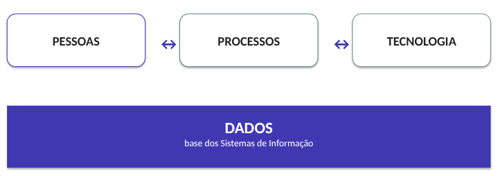

# Introdução

## O que é um Sistema de Informação ?
- Um Sistema de Informação não é apenas um software.
- Ele combina componentes **sociais** e **técnicos** para coletar, processar, armazenar e distribuir informações.
- Seu valor aparece quando a tecnologia se articula às necessidades de usuários, processos e organizações.

**Pessoas + Processos + Dados + Tecnologia**

### SI como sistema sociotécnico
**Subsistema social**
- Pessoas
- Papéis e responsabilidades
- Processos
- Cultura e regras

**Subsistema técnico**
- Hardware
- Software
- Dados
- Redes e infraestrutura

**O desempenho do SI depende da interação entre os dois.**

### Conceito
Um Sistema de Informação reúne elementos **inter-relacionados** para **coletar**, **processar**, **armazenar** e **distribuir informações**, apoiando operações, coordenação e tomada de decisão.
- Apoiar operações
- Coordenar atividades
- Apoiar decisões

> [!NOTE]
>
> **O SI está inserido em uma organização e em um contexto de uso.**

### Sistema de Informação x Software 

- **Software:** É parte da dimensão tecnológica.
    - Implementa funcionalidades e regras.
- **Sistema de Informação:** Inclui pessoas, processos, tecnologia e os dados que sustentam seu funcionamento.

> [!WARNING]
>
> Um **problema** de SI pode **existir** mesmo quando o software está tecnicamente funcionando.

## Elementos dos SI
O valor do SI emerge da integração entre essas dimensões.

### Pessoas
- Utilizam, alimentam, administram e projetam os Sistemas de Informação.
- Tomam **decisões** a partir das informações produzidas.
- Possuem papéis, responsabilidades, conhecimentos, necessidades e expectativas.
- Podem adaptar, contornar ou até rejeitar uma solução tecnológica

### Processos
- Representam **como o trabalho** é realizado.
- Envolvem atividades, regras, responsabilidades, decisões e fluxos.
- O SI pode apoiar, automatizar, integrar ou transformar processos.
- Digitalizar um processo não significa, necessariamente, melhorá-lo.

### Tecnologia
- Viabiliza coleta, processamento, armazenamento e comunicação.
- Inclui software, hardware, bancos de dados, redes, dispositivos e serviços.
- Permite automatizar e integrar atividades.
- É indispensável em muitos SI contemporâneos, mas não explica o sistema sozinha

### Dados
Os dados são a base de todo o SI, circulam e sustentam todo o processo.
- Coletados pelas pessoas e pelos processos.
- Processados pela tecnologia.
- Interpretados para produzir informação.
- Utilizados para executar processos e apoiar decisões.

Exemplo: Estudante solicita matrícula $\rightarrow$ Regras são verificadas $\rightarrow$ Sistema registra $\rightarrow$ Resultado é comunicado.

## Sistemas de Informação são Sistemas Sociotécnicos
O funcionamento de um SI depende do ajuste entre dimensões sociais e técnicas.
- O desafio não é otimizar apenas um lado, mas alcançar **alinhamento** entre ambos 

**Subsistema Social:** Pessoas, processos, estrutura organizacional, cultura e tomada de decisão, o "porquê" e o "para quem" do sistema.

**Subsistema Técnico:** Hardware, software, dados, redes e ferramentas, a infraestrutura que viabiliza o ciclo de informação.

Falhas em SI raramente são **falhas tecnológicas puras**. São falhas de alinhamento entre o subsistema social e o técnico, o que exige pesquisa e ensino que integrem as duas dimensões.
- **Visão Holística:** Decisões melhores e mais éticas
- **Qualidade e Eficiência:** Sistemas mais confiáveis e inovadores
- **Impacto Social:** Maior satisfação e responsabilidade

Quando há o desalinhamento:
- **Tecnologia × Pessoas:** O sistema funciona, mas ninguém quer utilizá-lo.
- **Processo × Dados:** O processo exige informações que não são coletadas.
- **Tecnologia × Processo:** A ferramenta não representa o fluxo real de trabalho.
- **Pessoas × Dados:** Usuários não confiam na qualidade das informações

> [!NOTE]
>
> O fracasso de um SI raramente pode ser explicado apenas pelo código.

## Onde encontramos Sistemas de Informação ?
- **Universidade:** Matrícula, notas, histórico
- **Banco**: Contas, pagamentos, crédito
- **Hospital:** Pacientes, exames, atendimento
- **Comércio:** Vendas, estoque, clientes
- **Governo:** Serviços, processos, benefícios
- **Mobilidade:** Rotas, viagens, pagamentos

### Exemplo: SIGAA
- **Pessoas:** Estudantes, docentes, técnicos.
- **Processos:** Matrícula, oferta, notas.
- **Tecnologia:** Aplicações, BD, integrações.
- **Dados:** Estudantes, componentes, turmas, notas, vínculos, histórico.

> [!NOTE]
>
> O SIGAA que aparece na tela é apenas uma interface para um sistema organizacional muito maior.
