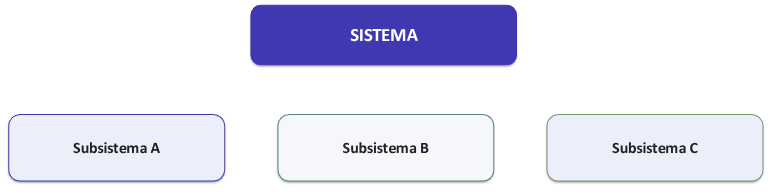
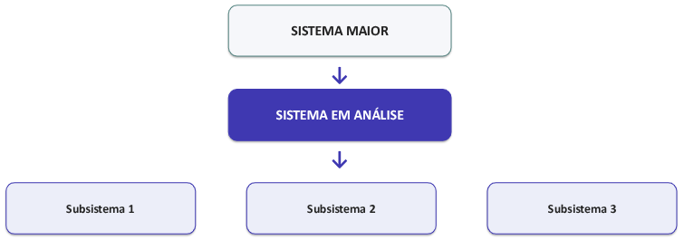
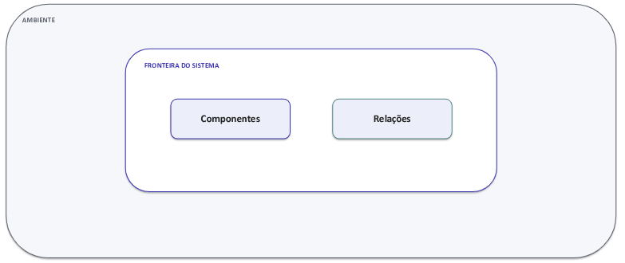
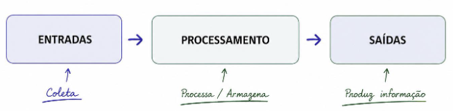
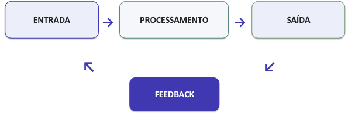

# Teoria Geral de Sistemas

## O que é um Sistema ?

Um sistema é um conjunto de **elementos inter-relacionados** que atuam de forma organizada para produzir determinado comportamento ou resultado.
- Elementos.
- Relações
- Objetivo/Resultado
- Não basta identificar as partes: é preciso compreender como elas **interagem**.

## Fundamentos da Teoria Geral de Sistemas
-  A TGS busca princípios gerais para compreender sistemas de diferentes naturezas.
- O foco deixa de ser apenas o componente isolado e passa às **relações**, à **organização** e ao comportamento do conjunto.
- A compreensão do todo exige considerar interdependências entre os elementos.
- Em Sistemas de Informação, essa abordagem ajuda a evitar uma visão exclusivamente tecnológica.

### Sistema, Componentes e Subsistemas
Subsistemas possuem **funções próprias**, mas permanecem relacionados. A interação entre eles contribui para o comportamento do sistema como um todo.

### Hierarquia e Interdependência
Um sistema pode **fazer parte de outro sistema** e ser influenciado por elementos de níveis superiores ou do mesmo nível.

### Ambiente e Fronteira
A fronteira define o **recorte da análise**, enquanto o ambiente reúne **elementos externos** que podem **influenciar** o sistema.
- Os dados influenciam a fronteira do sistema.

### Entradas, Processamento e Saídas
O sistema recebe elementos do ambiente, realiza **transformações** e produz **resultados** que retornam ao ambiente.
- Em um SI, entradas e saídas podem ser dados, informações, solicitações, registros, decisões ou serviços.

### Retroalimentação (Feedback)
A informação sobre os resultados pode **retornar ao sistema** e orientar correções, ajustes ou mudanças.

### Sistemas Abertos e Fechados
**Sistema Aberto:** 
- Interage com o ambiente.
- Recebe entradas e produz saídas.
- Pode adaptar-se a mudanças externas.

**Sistema Fechado:**
- É concebido como isolado do ambiente.
- Na prática, sistemas completamente fechados são raros.

Organizações e Sistemas de Informação são tipicamente analisados como **sistemas abertos**, pois dependem de pessoas, regras, recursos, informações e outros sistemas.

### Visão Sistêmica
A visão sistêmica procura compreender o conjunto sem perder de vista as relações entre as partes.

- **Totalidade:** O comportamento do todo não se reduz às partes.
- **Interdependência:** Mudanças em uma parte podem afetar outras.
- **Contexto:** O ambiente influencia o sistema.
- **Relações:** Conexões importam tanto quanto componentes.

### Por que a visão sistêmica importa em SI ?
- Um SI não funciona **isoladamente**: está inserido em processos, estruturas e regras organizacionais.
- Uma **mudança tecnológica** pode alterar atividades, responsabilidades e fluxos de informação.
- Problemas **locais** podem produzir efeitos em outros **subsistemas**.
- Uma solução tecnicamente correta pode falhar quando ignora dependências organizacionais ou o ambiente.
- A análise sistêmica ajuda a compreender impactos antes de tratar cada componente separadamente

### Exemplo - SIGAA
- **Entradas:** Cadastros, solicitações, regras, ofertas
- **Processamento:** Validações, registros, cálculos, fluxos
- **Saídas:** Matrículas, históricos, resultados, relatórios
- **Ambiente:** Normas, unidades, calendário, outros sistemas
- **Feedback:** Erros, demandas, indicadores, mudanças normativas
- **Subsistemas:** 
    - Graduação 
    - Pós-graduação 
    - Turmas e Oferta
    - Avaliação 
    - Histórico 
    - Gestão Acadêmica

> [!NOTE]
>
> Os subsistemas podem compartilhar dados, regras, usuários e serviços.

## Atividade - Escolha um Sistema de Informação e represente-o como sistema.

Sistema: Microsoft Teams

### Qual é a finalidade do sistema ?  
A finalidade do Microsoft Teams é permitir a comunicação entre usuários, por meio de mensagens, chamadas, videoconferências, compartilhamento de arquivos e organização de equipes.

### Quais são seus componentes e subsistemas ?
- Chat e mensagens
- Chamadas e videoconferências
- Equipes e grupos
- Calendário e reuniões
- Notificações
- Compartilhamento de arquivos e trabalhos

### Onde você colocaria a fronteira ? 
A fronteira se relaciona com os recursos e serviços controlados pelo Microsoft Teams, incluindo seus servidores, aplicativos e funcionalidades.

### Quais elementos fazem parte do ambiente ?
- Usuários
- Internet
- Computadores e celulares
- Câmeras
- Microfones
- Regras de Negócio
- Outros sistemas e serviços externos

### Quais são entradas, processamento e saídas ? 
Entradas:
- Cadastro e dados dos usuários
- Mensagens e arquivos enviados
- Agendamento de reuniões

Processamento:
- Autenticação e validação dos usuários
- Armazenamento e transmissão de dados
- Gerenciamento de equipes e permissões
- Controle de chamadas e reuniões

Saída:
- Mensagens recebidas
- Notificações
- Videoconferências
- Arquivos compartilhados
- Informações sobre reuniões e atividades

### Que formas de feedback podem provocar mudanças ?
- Sugestões e demandas dos usuários
- Relatos de bugs e erros
- Concorrência com outros sistemas de comunicação
