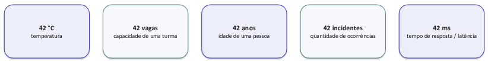
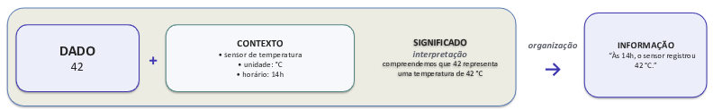

# Dados, Informação e Conhecimento

O que estes registros dizem ?
- 42
- 25/08/2026
- CIC0101
- APROVADO

Por enquanto, são apenas registros. Podemos reconhecer seu formato, mas não sabemos necessariamente o que representam.

## Dado
Dado é uma **representação de fatos**, **eventos**, objetos ou ocorrências, registrada de forma que possa ser armazenada, comunicada ou processada.

- 42: **Numérico**
    - 42 estudantes apro vados na disciplina.

- 25/08/2026: **Data**
    - Data de realização da aula.

- CIC0101: **Alfanumérico/código**
    - Código da disciplina Sistemas de Informação

- APROVADO: **Categoria**
    - Situação final de um estudante na disciplina

> [!NOTE]
>
> Dado **não é sinônimo** de número: pode ser representado por números, datas, textos, códigos, categorias, imagens, sons etc.

O mesmo dado pode significar coisas diferentes. Por exemplo, sem contexto, o registro "42" é **ambíguo**.

O valor é o mesmo em todos os exemplos. O que muda é aquilo a que ele se refere. 

Só olhar para "42" não permite saber qual dessas interpretações é correta. E justamente para resolver essa ambiguidade que precisamos de **contexto**.

### Contexto e Significado
- **Contexto:** Conjunto de circunstâncias e referências que permite interpretar 
corretamente um dado.
- **Significado:** Sentido que conseguimos atribuir ao dado quando o relacionamos ao 
contexto.

Exemplo Anterior:
- **Sem Contexto:** Sabemos que 42 é um valor, mas não sabemos o que ele representa.
- **Com Contexto:** 42 é uma leitura de um sensor de temperatura configurado em °C. 
    - Agora o dado tem significado: sabemos o que o valor representa.

O contexto **não é o significado**: Ele fornece as referências necessárias para que possamos atribuir significado ao dado.

Dados precisam de contexto para adquirir significado. No próximo passo, veremos como dados contextualizados e organizados constituem informação

### Informação
O **significado** é o **sentido atribuído** aos dados em um contexto. A informação é esse **conteúdo significativo** organizado de forma compreensível e comunicável.

- **Significado != Informação:** Significado é o **sentido** que conseguimos atribuir ao dado ao interpretá-lo no contexto.
- **Informação:** É o conteúdo significativo organizado em uma forma que pode ser compreendida e comunicada.

Assim, o significado participa da construção da informação: ele permite compreender o que os dados representam.

## Valor da Informação
Valor da informação é sua **utilidade para reduzir incerteza**, compreender uma situação ou apoiar uma ação/decisão em determinado contexto.
- Informação: 50 estudantes matriculados em CIC0101
- Para a coordenação: pode ajudar a decidir sobre oferta e recursos
- Para outro usuário: pode não ter utilidade naquele momento

Logo, valor não é uma propriedade absoluta da informação: depende de quem precisa dela, para quê e quando.

### Inteligência Artificial
Muitos sistemas de IA aprendem **padrões a partir de dados**. Por isso, aquilo que o sistema consegue produzir depende, em grande medida, dos **dados utilizados** e de como eles são preparados.

- Dados: Históricos, Textos, Imagens, Registros. 
- Preparação e Contexto: Seleção, Organização, Representação.
- Sistema de IA: Aprende Padrões, Realiza inferências. 
- Resultados: Classificações, Previsões, Recomendações, Conteúdo.

Em IA, o valor potencial dos dados depende também de sua **qualidade**. Essa relação nos leva ao próximo conceito: Qualidade dos dados e da informação.

## Qualidade da Informação
Qualidade da informação é o grau em que a **informação** apresenta **características adequadas** às necessidades de quem a utiliza e ao propósito para o qual será usada.
- Sistema Informa: 35 estudantes matriculados.
- Situação Real: 50 estudantes matriculados.

Se a coordenação usar a **informação incorreta**, pode tomar uma decisão inadequada mesmo que o software esteja funcionando perfeitamente.

### Dimensões da Qualidade da Informação
- **Precisão:** O valor registrado **corresponde ao fato** que pretende representar.
    - Ex: Sistema registra 35, mas há 50 estudantes
- **Completude:** Todos os elementos **necessários** estão presentes.
    - Ex: Lista de matrícula omite estudantes de uma modalidade.
- **Atualidade:**  A informação está **atualizada** no momento em que precisamos dela. 
    - Ex: número de vagas de ontem pode não servir hoje. 
- **Consistência:** Registros relacionados apresentam **valores compatíveis**.
    - Ex: SIGAA informa 50; outro sistema institucional informa 42 
- **Relevância:** A informação é **pertinente** para a necessidade ou decisão. Uma informação correta pode ser **irrelevante**.
- **Acessibilidade:** Quem precisa consegue obter a informação, no formato e momento 
adequados. Acesso também deve respeitar autorizações

> [!NOTE]
>
> - Uma **informação** pode ser precisa nos **registros existentes** e ainda assim estar incompleta.
> - Qualidade também depende do **tempo** e da **coerência** entre diferentes registros e fontes.
> - Disponibilidade sem pertinência não resolve; pertinência sem acesso também não.

### Qualidade != Valor
- **Alta Qualidade, Baixo Valor:** Relatório preciso, completo e atualizado sobre um tema que não tem relação com a decisão atual.
- **Alto Valor, Qualidade Limitada:** Informação incompleta pode ser útil em uma emergência, mas exige cautela na decisão.

## Atividade 01
1. Foi atualizado há 20 dias: Atualidade
2. Não inclui estudantes da lista de espera: Completude
3. Mostra 42 vagas ocupadas; o SIGAA mostra 50: Consistência
4. Só pode ser acessado por um servidor que está ausente: Acessibilidade

Não. 

## Segurança da Informação
Segurança da informação busca preservar propriedades importantes da informação. Um modelo clássico é a tríade CID - **confidencialidade, integridade e disponibilidade**.
- **Confidencialidade:** Informação acessível apenas a quem está autorizado.
- **Integridade:** Informação correta e protegida contra alteração indevida.
- **Disponibildade:** Informação e serviços acessíveis quando necessários.

CID **não substitui** qualidade: segurança e qualidade tratam de aspectos diferentes, mas relacionados.

Qualidade pergunta se a informação é adequada ao uso; segurança pergunta como preservá-la e protegê-la.

## Atividade 02
- Caso 01: Um estudante consegue visualizar as notas de outros estudantes - Confidencialidade.
- Caso 02: Uma nota é alterada sem autorização - Integridade.
- Caso 03: O SIGAA fica indisponível durante o período de matrícula. - Disponibilidade.

## Conhecimento
Conhecimento **não é apenas** possuir informação: envolve compreendê-la, relacioná-la a experiências e utilizá-la para explicar situações e orientar ações.

- **Informação**: 50 estudantes estão matriculados na turma.
- **Experiência/Interpretação**: Em turmas grandes, certas atividades exigem mais organização, tempo e acompanhamento.
- **Conhecimento**: Turmas desse porte exigem estratégias adequadas de ensino 
e acompanhamento.
- **Decisão/Ação**: Adaptar a dinâmica das atividades, a organização da turma e as formas de acompanhamento.

> [!NOTE]
>
> Conhecimento pode orientar decisões e ações, mas a decisão não é o conhecimento em si.

### Dados $\rightarrow$ Informação $\rightarrow'$ Conhecimento
- **Dados:** Registros de fatos, eventos ou observações.
    - Ex: 50
- **Informação:** Conteúdo contextualizado, interpretado e com significado.
    - Ex: 50 estudantes estão matriculados.
- **Conhecimento:** Compreensão construída a partir de informação, experiência e aprendizagem.

## Atividade 03
- Dado: 7,5.
- Informação: A média da turma foi 7,5.
- Informação: A média aumentou depois que a estratégia de ensino foi alterada.
- Conhecimento: O professor conclui, com base em experiências anteriores e no s resultados, que a nova estratégia deve ser mantida

### Explícito X Tácito
- **Conhecimneto Explícito:** Conhecimento que pode ser articulado, documentado e compartilhado de forma relativamente estruturada.
    - Ex: normas, manuais, procedimentos, relatórios

- **Conhecimneto Tácito:** Conhecimento ligado à experiência, habilidades, julgamento e práticas, muitas vezes difícil de formalizar integralmente.
    - Ex: experiência de um técnico para reconhecer sinais de falha

## Dados
Como Extrair Valor ?
- Explorar e analisar dados para identificar padrões, gerar evidências, apoiar previsões e decisões.
    - Ciência de Dados

Como Cuidar desses Recursos ?
- Definir responsabilidades, regras, qualidade, acesso, proteção e uso adequado dos dados.
    - Gestão e Governança de Dados

### Ciência de Dados X Gestão e Governança de Dados
**Ciência de Dados** é uma área interdisciplinar que combina métodos computacionais, estatísticos e analíticos para explorar dados e produzir evidências úteis.

**Gestão de Dados:** Execução das atividades necessárias para coletar, armazenar, integrar, manter, disponibilizar e proteger dados ao longo de seu ciclo de vida.

**Governança de Dados:** Definição de autoridade, responsabilidades, políticas e mecanismos para orientar e controlar a gestão e o uso dos dados.
 

### Valor e Qualidade
Se dados podem gerar informação e conhecimento, pode parecer vantajoso coletar tudo o que estiver disponível. Mas quantidade não é sinônimo de valor.
- **Valor:** Dados são valiosos quando são pertinentes à finalidade e ajudam a produzir informação  útil.
- **Qualidade:** Mais dados podem significar mais redundância, desatualização, inconsistência e custo de manutenção
- **Privacidade:** Dados pessoais devem ser tratados de forma adequada à finalidade e limitados ao necessário.

> [!NOTE]
>
> Na LGPD, essa ideia aparece no **princípio** da necessidade: limitar o tratamento ao mínimo necessário para realizar suas finalidades, com dados pertinentes, proporcionais e não excessivos.
