# Introdução à Grafos
- [Aplicações](#aplicações)
- [Definições](#definições)
- [Terminologia](#terminologia)

Tópico fundamental em Matemática Discreta e Ciência da Computação.
- Usados para **modelar** inúmeras situações comuns.
- Permitem **descrições** e **desenvolvimento** de **algoritmos** para a solução de problemas.

A teoria de grafos foi criada em 1700 pelo matemático **Euler**.
- Buscavasse responder o seguinte problema envolvendo um rio: 
- Como iniciar em quaisquer das áreas A, B, C ou D, atravessar todas as pontes, somente uma vez cada, e chegar ao ponto de partida? (mostrem pelo menos 2 tentativas)

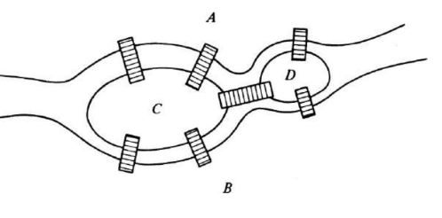

Para atingir uma resposta, Leonhard Euler propôs esse desenho indicando os **pontos** como massas de terra e as **linhas** sendo as pontes. 
- Demostrando que não seria possível realizar a visita passando uma única vez em cada ponte.

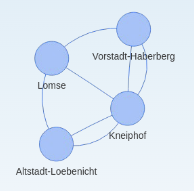

## Aplicações
Existem infinitas formas de abstrações de problemas usando grafos. Vamos mostrar alguns exemplos de modelagens abaixo.

### Mapa de Cidades

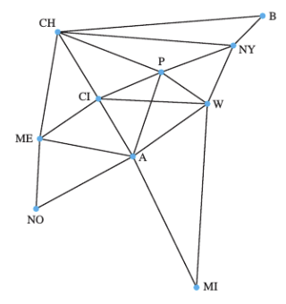

Um mapa estilizado de cidades dos EEUU, onde:
- Nas cidades (pontos azuis), há centros de processamento de dados de uma empresa.
- As linhas indicam comunicações dedicadas entre elas.

Pergunta-se:
- Qual o número mínimo de elos (links) que poderiam ser usados para mandar uma mensagem de B para NO ?
- Qual seria a rota dessa mensagem ?
- Qual(s) cidade(s) têm o maior número de elos de comunicação saindo dela(s) ?
- Qual o número total de elos(links) nessa configuração ?

### Rede de Amizades

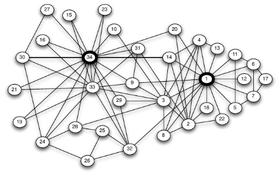

Possível representação de uma rede de amizades (entre 34 pessoas) em um clube de karatê.
- Após a representação, podemos infereir diversas informações como quem são as pessoas mais populares, quem é amigo de quem, como fazer para uma informação chegar de forma mais eficiente.

### Emails dos Funcionários
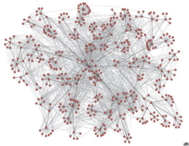

Padrões de comunicação de email entre 436 funcionários de uma empresa.
- Após a representação, o que pode-se inferir desses dados? Relações?

### Empréstimos
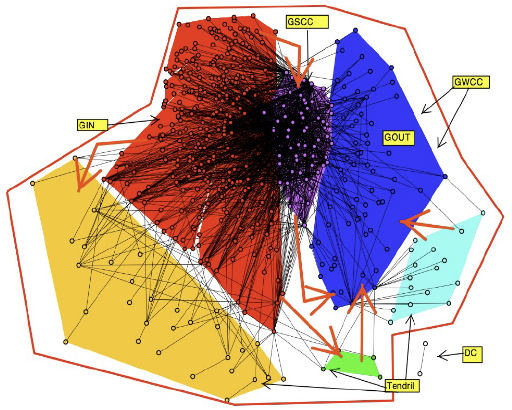

Rede de empréstimos entre instituições financeiras.
- Após a representação, o que pode-se inferir desses dados? Relações?

### Comércio
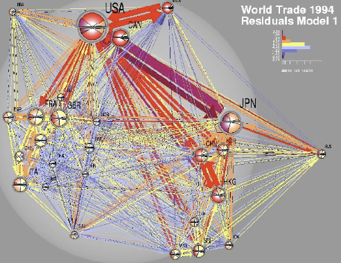

Rede de transações em comércio internacional.
- Após a representação, o que pode-se inferir desses dados? Relações?

### Epidemia
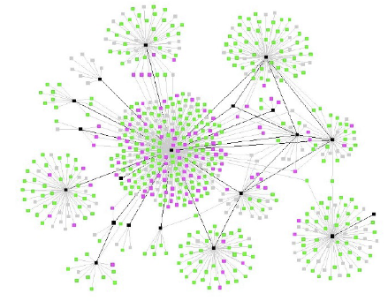

Rede de contágio de uma doença epidêmica.
- Após a representação, o que pode-se inferir desses dados? Relações?

## Definições
Um grafo consiste em um **conjunto de vértices** (nós), e um **conjunto de arestas** (elos).
- Cada aresta **liga dois nós** (**não** necessariamente **diferentes**).
- Podemos **representar genericamente** um grafo por: $G = (V,E)$

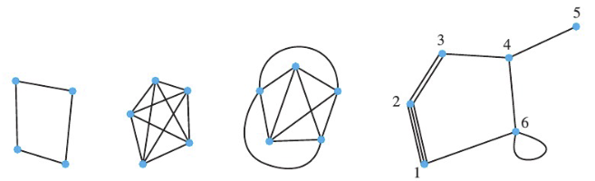

## Terminologia

- Dois vértices $u, v$ são vértices terminais de uma aresta $(u,v)$.
- **Arestas Parelelas:** Tem os mesmos vértices **terminais**.
- **Laço:** É uma aresta da forma $(v,v)$.
- **Grafo Simples:** É um grafo que **não** tem **arestas paralelas** ou **laços**.
- **Grafo Vazio:** É um grafo **sem arestas**.
- **Grafo Nulo:** É um grafo **sem vértices**.
- **Grafo Trivial:** É um grafo com **somente um vértice**.
- **Arestas Adjacentes:** Arestas são adjacentes se elas compartilham um mesmo vértice terminal.
- Dois vértices $u, v$ são adjacentes se eles são **ligados por uma aresta**, ou seja $(u,v)$ é uma **aresta**.
- O **grau do vértice** $v$, escrito $d(v)$, é o **número de arestas** com v sendo terminal.
    - O **grau mínimo dos vértices** de um grafo por: $\delta(G)$.
    - O **grau máximo dos vértices** de um grafo por: $\Delta(G)$.

### Exemplo

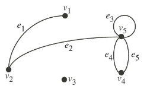

- Neste grafo os vértices são: $V = \{ v_1, \ldots, v_5 \}$
- E os elos (arestas): $E = \{ (v_1,v_2), (v_2,v_5), (v_5,v_5), (v_5,v_4), (v_5,v_4) \}$
- $v_4$ e $v_5$ são vértices **terminais** de $e_5$.
- $e_4$ e $e_5$ são paralelos.
- $e_3$ é laço.
- O grafo **não** é simples.
- $e_1$ e $e_2$ são adjacentes.
- $v_1$ e $v_2$ são adjacentes.
- O grau de $v_1$ é 1.
- O grau de $v_5$ é 5.
    - O laço **conta 2** em grau de vértice.
- $\delta(G) = 0$
- $\Delta(G) = 5$

### Grafo Regular
Um grafo G é dito **regular** se todos os vértices de G tiverem o **mesmo grau**. 
- Se o grau for **r**, então G será **regular de grau r**.

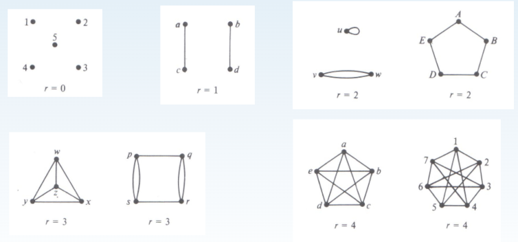

## Teorema
O grafo $G = (V,E)$, onde $V = \{ v_1, \ldots, v_n \}$ e $E = \{ e_1, \ldots, e_m \}$ satisfaz:

$$
\sum^{n}_{i = 1} d(v_i) = 2m.
$$

Em qualquer grafo, a **soma de todos os graus** dos vértices é igual a **duas vezes** o **número de elos**(arestas).

### Exercício

- Vértices: 10
- Elos: 20
- $\sum^{n}_{i = 1} d(v_i) = 2m = 2 + 2 + 2 + 4 + 4 + 5 + 5 + 5 + 5 + 6 = 2 \bullet 20 = 40$.

### Consequências do Teorema
- Em qualquer grafo, a **soma de todos** os graus de vértices é um **número par**.
- Em qualquer grafo, o **número de vértices de grau ímpar** é **par**. 
- Se $G$ é um grafo que possui $n$ vértices e é **regular de grau** $r$, então $G$ tem exatamente $\frac{1}{2}nr$ elos (arestas).

## Grafos e Subgrafos
