# Grafos e Subgrafos

O grafo $G_1 = (V_1,E_1)$ é um **subgrafo** de $G_2 = (V_2,E_2)$ se $V_1 \subseteq V_2$ e **todo elo (aresta)** de $G_1$ for também um elo (aresta) de $G_2$.
- Todo grafo é **subgrafo dele mesmo**.
- O subgrafo de um subgrafo de $G$ é um **subgrafo** de $G$.
- Um **vértice** de $G$ é um **subgrafo** de $G$.
- Uma **aresta** de $G$ com seus **dois vértices** é um subgrafo de $G$.

### Exemplos

#### Grafo
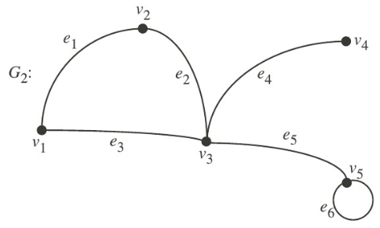

#### Subgrafos
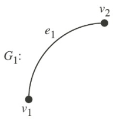

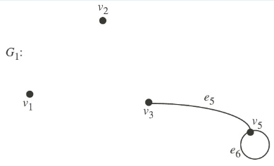

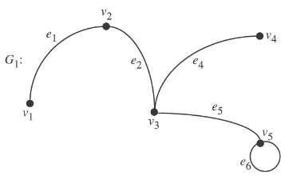

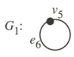

## Subgrafo

### Redução por Arestas
Um  subgrafo $G$ pode ser obtido por um **subconjunto de arestas** e seus respectivos vértices. Subgrafo obtido por redução de arestas.

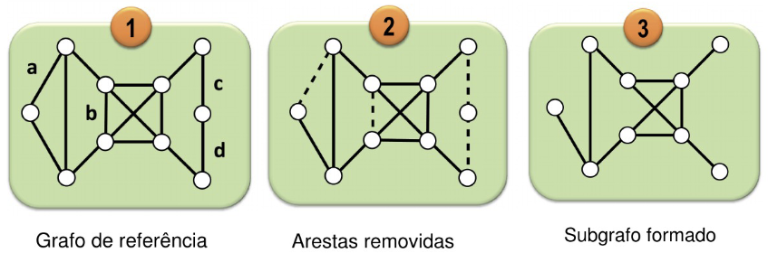

### Redução por Vértices
Um  subgrafo $G$ pode ser obtido por um **subconjunto de vértices** e suas respectivas arestas. Subgrafo obtido por redução de vértices.

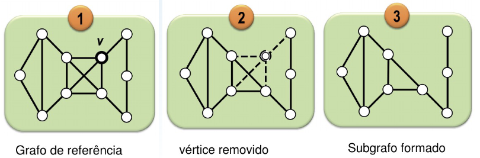

### Subgrafo Induzido
Um subgrafo induzido $G' = (V', E')$ de um grafo $G = (V, E)$ é um grafo tal que $V' \subseteq V$ e $E'$ contém **todas os elos (arestas)** em $E$ que tem as **duas extremidades** em $V'$.

#### Grafo 
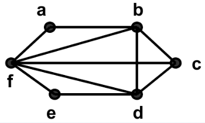

#### Subgrafos Induzidos

Isso é um subgrafo induzido.

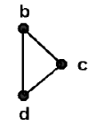

Isso não é subgrafo induzido.

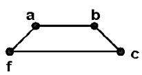

## Exercício
Quantos subgrafos com pelo menos um vértice possui $K_3$ ?

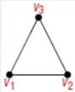

- Com 1 vértice: 3

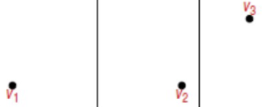

- Com 2 vértice: 6

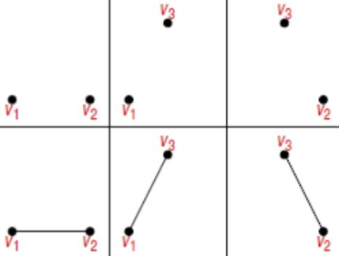

- Com 3 vértice: 8

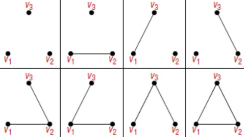

Resposta: $3 + 6 + 8 = 17$

## Isomorfismo entre Grafos
**Definição:** Dois grafos $G$ e $H$ são **isomorfos** se $H$ pode ser obtido de $G$ renomeando  os vértices.  
- Isto é, se há uma correspondência **um-para-um** entre os vértices de $G$ e aqueles de H, tal que o **número de elos(arestas)** unindo qualquer **par de vértices** em $G$ é **igual ao número de elos(arestas)** unindo os pares correspondentes de vértices em $H$.
- Preserva as arestas, **mesmas conexões** com nomes diferentes.

Dois grafos $G = (V, E)$ e $H = (W, F)$ são **isomórficos** se houver uma função bijetiva $f: V \to W$ tal que para todos $v, w \in V$: $\{ v, w \} \in E \leftrightarrow \{ f(v), f(w) \} \in F$

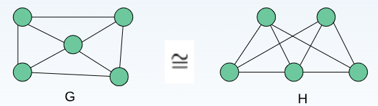

### Exemplo
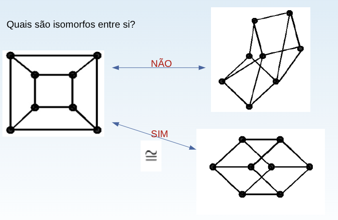

### Algoritmo

### Força bruta:
- Iniciar em um nó, avaliar seus adjacentes e buscar diferenças do outro grafo;
- até o último elemento dos grafos;

### NP (Não Polinomial)
- **Não** há (ainda) algoritmo que decide o isomorfismo entre 2 grafos (quaisquer) em tempo polinomial.

### Uso de Invariantes 
Checar antes as diferenças nos 2 grafos:
1. Número de vértices/nós;
2. Múmero de arestas;
3. A distribuição dos graus dos vértices;
4. Índice cromático do grafo;
5. Cobertura mínima do grafo

### NP
- O melhor, largamente aceito, possui $2^{\Theta(\sqrt{n} \ log \ n })$.  
- Em 2017 Babai propôs um algoritmo **subpolinomial** com $2^{\Theta(3(log \ n)})$. 
