# Adjacência, Representação e Cliques

## Adjacência e Incidência em Grafos

**Definição:** Sejam $v$ e $w$ vértices de um grafo. Se $v$ e $w$ são ligados por um elo(aresta) k, então $v$ e $w$ são ditos **adjacentes**.
- $v$ e $w$ são ditos incidentes com k, e k incidente com $v$ e $w$. 

### Exemplo: Adjacências entre os estados do Brasil

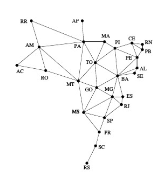

- Qual(s) o(s) estado(s) com maior número de adjacências? i.e. maior  grau? Bahia (8)
- Qual(s) o(s) estado(s) com menor número? Amapá(1) e Rio Grande do Sul(1)

## Representações de Grafos
A **matriz de adjacência** envolve a adjacência dos vértices.

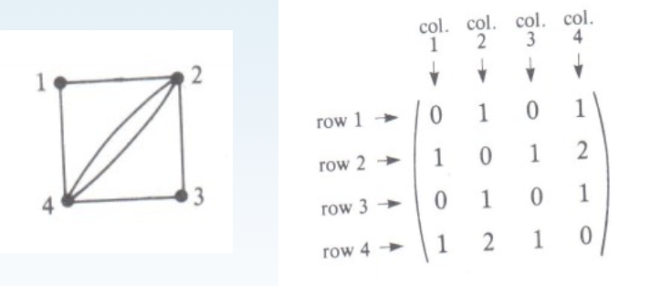

A **matriz de incidência** envolve a incidência de vértices e arestas.

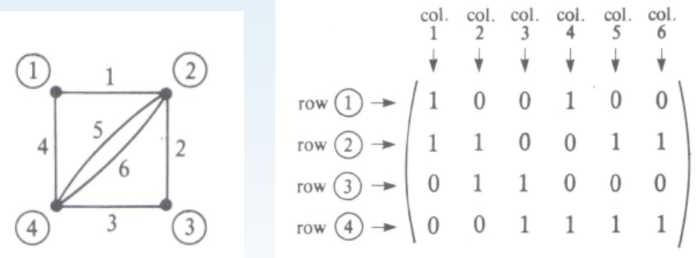

### Representação com Matriz de Adjacências e Lista de Adjacências
- Arranjo Bidimensional: $V X V$ 
- Aresta $v-w$ no grafo: `adj[v][w] = adj[w][v] = 1`.

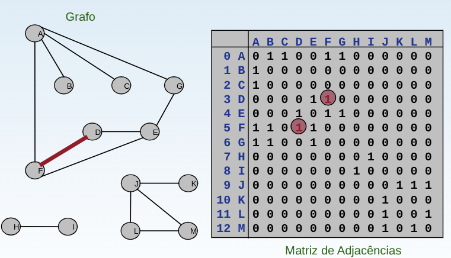

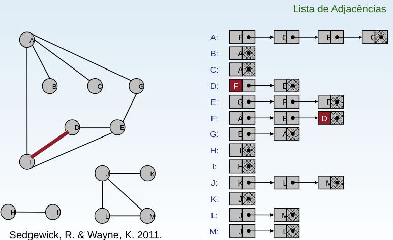


Grafos são objetos **matemáticos abstratos**.
- Implementação TAD requer representação específica.
- Eficiência depende de **algoritmos de casamento** das representações.

> [!NOTE]
>
> A maioria dos grafos para problemas reais são esparsos $\Rightarrow$ lista de adjacências.

| Representação      | Espaço   | Aresta entre v e w? | Aresta de v a qualquer lugar? | Enumerar todas arestas |
| :----------------: | :------: | :-----------------: | :---------------------------: | :--------------------: |
| Matriz Adjacência  | $O(V^2)$ | $O(1)$              | $O(V)$                        | $O(V^2)$               |
| Lista Adjacência   | $O(E + V)$ | $O(E)$            | $O(1)$                        | $O(E + V)$             |

## Tipo Abstrato de Dados (TAD)
- Conjunto de operações associadas a uma estrutura de dados.
- Independência de implementação para operações.

### Operadores TAD
1. `FGVazio(Grafo)`: Cria um grafo vazio.
2. `InsereAresta(V1, V2, Peso, Grafo)`: Insere uma aresta no grafo.
3. `ExisteAresta(V1, V2, Grafo)`: Verifica se existe uma determinada aresta.
4. `ListaAdj(Grafo, V)`: Obtém a lista de vértices adjacentes a um determinado vértice.
5. `RetiraAresta(V1, V2, Peso, Grafo)`: Retira uma aresta do grafo.
6. `LiberaGrafo(Grafo)`: Libera o espaço ocupado por um grafo.
7. `ImprimeGrafo(Grafo)`: Imprime um grafo.
8. `GrafoTransposto(Grafo, GrafoT)`: Obtém o transposto de um grafo direcionado.
9. `RetiraMin(A)`: Obtém a aresta de menor peso de um grafo com peso nas arestas.

Operadores para obter Lista de Adjacentes
1. `ListaAdjVazia(v, Grafo):` Retorna `true` se a lista de adjacentes de v está vazia.
2. `PrimeiroListaAdj(v, Grafo)`: Retorna o endereço do primeiro vértice na lista de adjacentes de v.
3. `ProxAdj(v, Grafo, u, Peso, Aux, FimListaAdj)`: Retorna o vértice u (apontado por Aux) da lista de adjacentes de v, bem como o peso da aresta (v, u). Ao retornar, Aux aponta para o próximo vértice da lista de adjacentes de v, e FimListaAdj retorna `true` se o final da lista de adjacentes foi encontrado.

### Matriz de Adjacência
A matriz de adjacência de um grafo $G = (V, A)$, contendo $n$ vértices é uma matriz $n X n$ de bits, onde $A[i,j]$ é 1 se e somente se existe um arco do vértice $i$ para o vértice $j$. 
- Deve ser utilizada para grafos **densos**, onde $|A|$ é próximo de $|V|^2$.
- O tempo necessário para acessar um elemento é **independente** de $|V|$ ou $|A|$.
- É muito útil para algoritmos em que necessitamos saber com rapidez se existe uma aresta ligando dois vértices.
- A maior desvantagem é que a matriz necessita $\Omega (|V|^2)$ de espaço. Ler ou examinar a matriz tem complexidade de tempo $O(|V|^2)$.
- A inserção de um novo vértice ou retirada de um vértice já existente pode ser realizada com custo constante.

### Lista de Adjacência: Usando Ponteiros
- Um arranjo $Adj$ de $|V|$ listas, uma para cada vértices em $V$.
- Para $u \in V, Adj[u]$ contém todos os vértices adjacentes a $u$ em $G$.

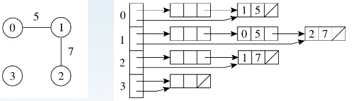

- Os vértices de uma lista de adjacência são em geral armazenados em uma ordem arbitrária.
- Possui uma complexidade de espaço $O(|V| + |A|)$.
- Indicada para grafos **esparsos**, onde $|A|$ é muito menor do que $|V|^2$.
- É compacta e usualmente utilizada na maioria das aplicações.
- A principal desvantagem é que ela pode ter tempo $O(|V|)$ para determinar se existe uma aresta entre o vértice $i$ e o vértice $j$, pois podem existir $O(|V|)$ vértices na lista de adjacentes do vértice $i$.

## Cliques
**Definição:** Um **clique** em um grafo não direcionado $G =(V,E)$, é um **subgrafo induzido completo (incluindo todos os vértices individualmente)**, e para 2 ou mais vértices, um subconjunto de vértices $C \subseteq V$, tal que para cada dois vértices em $C$ existe uma aresta entre esses.
- É um subconjunto de vértices em que todos os pares de vértices são diretamente conectados por uma aresta.

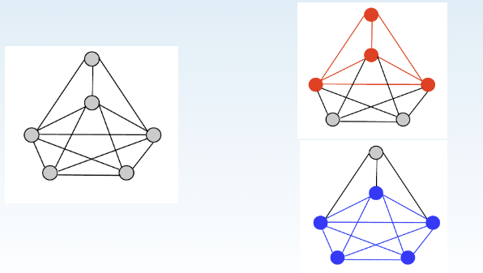

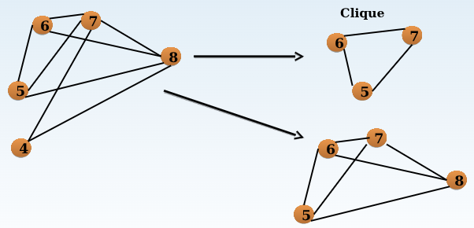

**Definição:** Um **clique máximo** é o **maior clique possível** em um dado grafo.

**Definição:** O número do clique $w(G)$ de um grafo $G$ é o **número de vértices** de um **clique máximo** em G.

**Definição:** Um **clique maximal** é um clique que **não pode ser estendido** pela **inclusão de mais um vértice adjacente**, ou seja, ele não é subconjunto de clique maior.

### Exemplo
Encontrar todos os cliques máximos e maximais desse grafo.

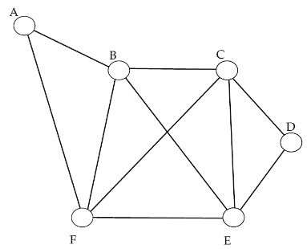

- Maximais: $\{A,B,F\} $; $\{ B,C,F,E \}$; $\{C, D, E\}$.
- Máximo: $\{ B,C,F,E \}$.

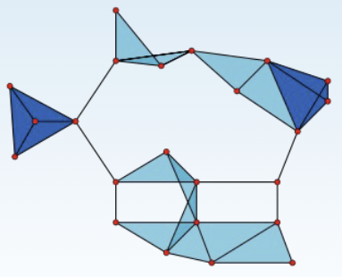

- 23 cliques (1 vértice).
- 42 cliques (2 vértices, i.e. arestas). 
- 19 cliques (3 vértices, triângulos azuis (claros e escuros)). 
- 2 cliques (4 vértices, áreas azul-escuras). 
- Os 11 triângulos azul-claros são cliques maximais.
- Os 2 cliques azul-escuros são máximos e maximais. 
- O número $w(G)$ do clique do grafo é **4**. 

### Como encontrar k-cliques em um grafo ?
Um algoritmo (**força bruta**) poderia ser:
- Examinar todos subconjuntos de tamanho k, e determinar se há algum clique.
- Qual seria o número desses subconjuntos?

$$
\binom{n}{k} = \frac{n!}{k!(n-k)!} > \left(\frac{n}{k}\right)^k
$$

Em um grafo de 100 vértices, se buscássemos por 10-cliques teríamos $\binom{100}{10} > \binom{100}{10}^{10} = 10^{10}$ subgrafos a examinar.

### Problema: Todos os cliques em um grafo 
Encontrar todos os cliques em um grafo é um **problema NP-completo** 
- Algoritmos eficientes são importantes.
- Inúmeras aplicações em escalonamento, bioinformática, codificação, reconhecimento de padrões.

### Algoritmo Bron-Kerbosch
- Gera apenas **cliques maximais**, evitando assim que cada conjunto gerado tenha que ser comparado com os previamente testados. 
- Opções sem, e com pivotamento.

Funcionamento:
- **Conjunto R**: Vértices que seriam parte do clique (ps. inicia vazio).
- **Conjunto P**: Vértices que têm ligação com todos os vértices de R (candidatos).
- **Conjunto X**: Vértices já analisados e que não levam a uma extensão do conjunto R. Usado para evitar comparação excessiva (ps. inicia vazio).

Passo a Paso:
-  **Chamada Inicial:** R e X vazios e P contendo todos os vértices do grafo.
- Em cada chamada recursiva, se **P está vazio**, um **clique maximal é encontrado** (se X também estiver vazio). Se X **não estiver vazio**, o algoritmo realiza **backtracking**.
- Para cada vértice v escolhido, faz-se uma **chamada recursiva adicionando** v em R.
- Os conjuntos P e X são restritos aos vizinhos de v, possibilitando encontrar todas as extensões de R que contém v.
- Quando todas as extensões de R que contém v forem analisadas, v é movido de P para X.
- Assim, todos os cliques maximais contidos no grafo são encontrados.
- No **pior caso**, o algoritmo apresenta complexidade exponencial $O(2^{|V|})$.

### Exemplo - Bron-Kerbosch

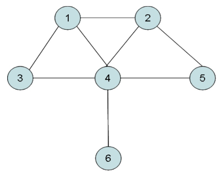

**Sem Pivotamento**
```plaintext
proc BK(P, R, X)
    1: if P U X = ∅ then
    2:     report R as a maximal clique
    3: end if
    4: for each vertex v ∈ P do
    5:     BK(P ∩ N(v), R U {v}, X ∩ N(v))
    6:     P ← P \ {v}
    7:     X ← X U {v}
    8: end for
```

**Com Pivotamento**
```plaintext
proc BKPivot(P, R, X)
    1: if P U X = ∅ then
    2:     report R as a maximal clique
    3: end if
    4: p ← ChoosePivot(P U X)
    5: for each vertex v ∈ P \ N(v) do
    6:     BKPivot(P ∩ N(v), R U {v}, X ∩ N(v))
    7:     P ← P \ {v}
    8:     X ← X U {v}
    9: end for
```

- $R = X = \emptyset$, $P = (1,2,3,4,5,6)$
- Escolhendo o elemento pivô $u$ como 4.
- O vértice 4 pertence a $P \setminus N(u)$, pois:
- $ (1,2,3,4,5,6) \setminus (1,2,3,5,6) = 4$. 
- Encontra os valores de $R_{new}$, $P_{new}$ e $X_{new}$.
- $ P_{new} = P \cap N(v), R_{new} = R \cup \{v\}, X_{new} = X \cap N(v)$.
- $R_{new} = 4$; $P_{new} = (1,2,3,5,6)$; $X_{new} = \emptyset$

Chamadas Recursivas:
- BronkKerbosch $(4, (1,2,3,5,6), \emptyset)$.
    - BronkKerbosch $((4,1), (2,3), \emptyset)$.
    - BronkKerbosch $((4,1,2), \emptyset, \emptyset)$.
    - Reporta $(4,1,2)$ como uma das cliques maximais.

- BronkKerbosch $(4, (1,2,3,5,6), \emptyset)$.
    - BronkKerbosch $((4,2), (1,5), \emptyset)$.
    - BronkKerbosch $((4,2,5), \emptyset, \emptyset)$.
    - Reporta $(4,2,5)$ como uma das cliques maximais.

- BronkKerbosch $(4, (1,2,3,5,6), \emptyset)$.
    - BronkKerbosch $((4,6), \emptyset, \emptyset)$.
    - Reporta $(4,6)$ como uma das cliques maximais.

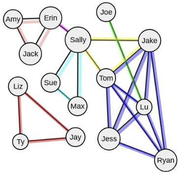
